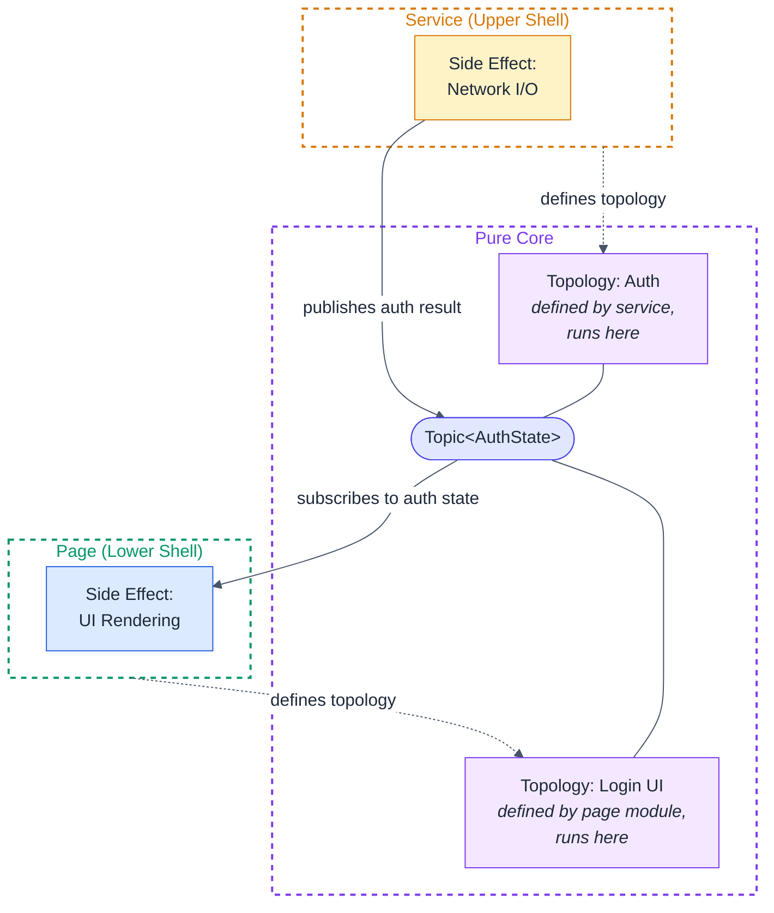
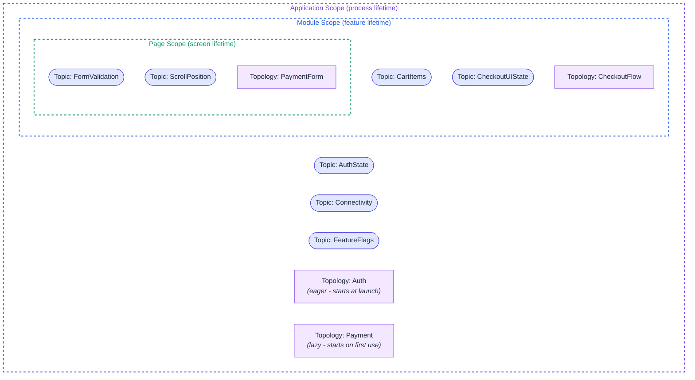
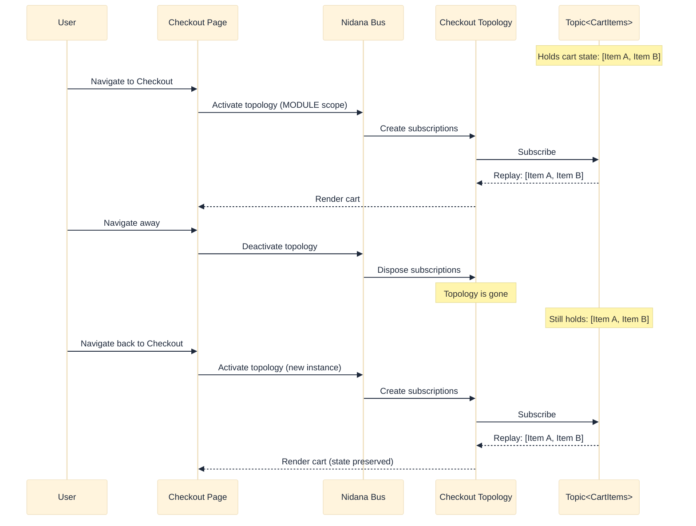
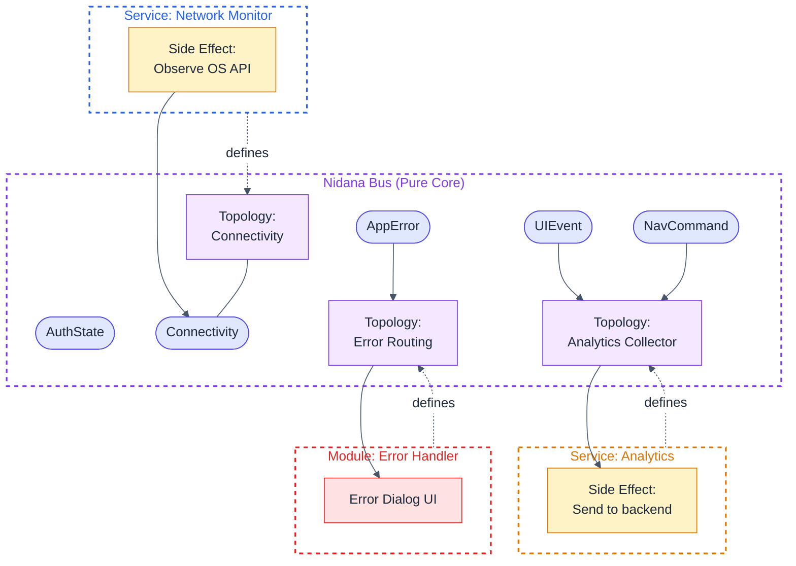
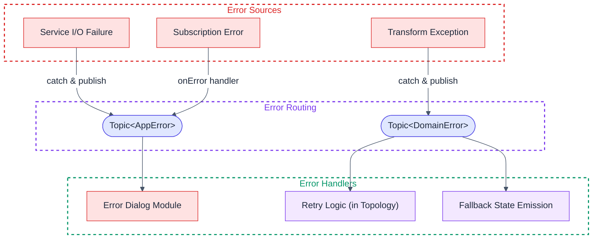
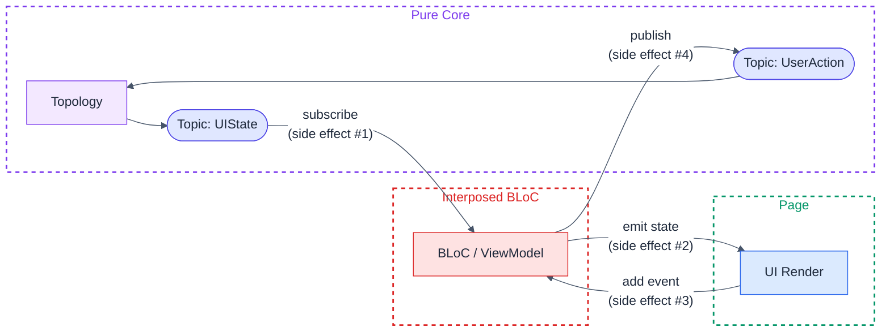

# Nidana Bus - A Reactive Data-Flow Architecture for Mobile and Web Applications

**Status:** Draft  
**Author:** Purbo  
**Version:** 0.8.4
**Date:** 2026-04-03

## Abstract

Nidana Bus is a platform-agnostic architectural pattern for mobile and web applications that positions a reactive event bus as the central coordination layer between side-effecting boundaries. Rather than coupling components through dependency injection graphs or direct service references, Nidana Bus introduces **typed topics** and **declarative topologies** as the primary abstraction for system-wide data flow.

The architecture enforces a pure-core/imperative-shell separation: the bus, its topic registry, and all active topologies form a declarative, composable core. Services (I/O, network, persistence) and UI pages/components (rendering, user interaction) form the imperative shells at the system boundaries.

This reference documents the architectural concepts, layered structure, lifecycle management strategies, data contract design, resilience properties, and platform mapping for Dart/Flutter, Kotlin/Android, Swift/iOS, and TypeScript/Web.

## Table of Contents

- [Nidana Bus - A Reactive Data-Flow Architecture for Mobile and Web Applications](#nidana-bus---a-reactive-data-flow-architecture-for-mobile-and-web-applications)
  - [Abstract](#abstract)
  - [Table of Contents](#table-of-contents)
  - [1. Motivation](#1-motivation)
    - [Design Principles](#design-principles)
  - [2. Core Concepts](#2-core-concepts)
    - [2.1 Topic](#21-topic)
      - [Topic Variants](#topic-variants)
    - [2.2 Topology](#22-topology)
    - [2.3 Bus (Runtime)](#23-bus-runtime)
    - [2.4 Message Envelope](#24-message-envelope)
      - [Envelope Field Definitions](#envelope-field-definitions)
    - [2.5 Topic Initialization](#25-topic-initialization)
      - [Who Creates Topics?](#who-creates-topics)
      - [The Rule on Initial Values](#the-rule-on-initial-values)
      - [The Persistence Pattern](#the-persistence-pattern)
  - [3. Topic Registry and Type Safety](#3-topic-registry-and-type-safety)
    - [3.1 The Problem With String-Based Topics](#31-the-problem-with-string-based-topics)
    - [3.2 Topic as First-Class Typed Reference](#32-topic-as-first-class-typed-reference)
    - [3.3 Topic Name Uniqueness Guarantee](#33-topic-name-uniqueness-guarantee)
      - [Enforcement Strategies](#enforcement-strategies)
    - [3.4 Topic Registry Organization](#34-topic-registry-organization)
      - [Naming Conventions](#naming-conventions)
      - [Enforcement and Governance](#enforcement-and-governance)
    - [3.5 Code Generation Approach (Optional)](#35-code-generation-approach-optional)
  - [4. Architectural Layers](#4-architectural-layers)
    - [4.1 Layer Diagram](#41-layer-diagram)
    - [4.2 The Symmetry of Services and Pages](#42-the-symmetry-of-services-and-pages)
    - [4.3 What Lives Where](#43-what-lives-where)
    - [4.4 Upper Shell: Services](#44-upper-shell-services)
    - [4.5 Pure Core: Nidana Bus](#45-pure-core-nidana-bus)
    - [4.6 Lower Shell: Modules and Pages](#46-lower-shell-modules-and-pages)
  - [5. Topology Composition](#5-topology-composition)
    - [5.1 Topology Declaration API](#51-topology-declaration-api)
    - [5.2 Transformer Design](#52-transformer-design)
    - [5.3 Reactive Combinators](#53-reactive-combinators)
    - [5.4 Topology Misuse: The Sequencer Anti-Pattern](#54-topology-misuse-the-sequencer-anti-pattern)
    - [5.5 Topology as Self-Documenting Data](#55-topology-as-self-documenting-data)
      - [Practical implications](#practical-implications)
  - [6. Lifecycle Management](#6-lifecycle-management)
    - [6.1 Lifecycle Scopes](#61-lifecycle-scopes)
      - [Service Topology Scopes](#service-topology-scopes)
    - [6.2 Approach A: Explicit Scope Declaration (Recommended)](#62-approach-a-explicit-scope-declaration-recommended)
    - [6.3 Approach B: Owner-Managed Lifecycle](#63-approach-b-owner-managed-lifecycle)
    - [6.4 Approach C: Reference-Counted Scopes](#64-approach-c-reference-counted-scopes)
    - [6.5 Topic vs. Topology Lifecycle](#65-topic-vs-topology-lifecycle)
    - [6.6 Topic Cleanup](#66-topic-cleanup)
  - [7. Data Contracts](#7-data-contracts)
    - [7.1 Principles](#71-principles)
    - [7.2 Recommended Approach: Platform-Native Immutable Data Classes](#72-recommended-approach-platform-native-immutable-data-classes)
    - [7.3 Alternative: Protocol Buffers (Protobuf)](#73-alternative-protocol-buffers-protobuf)
    - [7.4 Alternative: JSON Schema](#74-alternative-json-schema)
    - [7.5 Decision Matrix](#75-decision-matrix)
  - [8. Cross-Cutting Concerns](#8-cross-cutting-concerns)
    - [Patterns for Cross-Cutting Concerns](#patterns-for-cross-cutting-concerns)
    - [Envelope Interception](#envelope-interception)
  - [9. Error Handling Strategies](#9-error-handling-strategies)
    - [9.1 Error Propagation Model](#91-error-propagation-model)
    - [9.2 Principles](#92-principles)
    - [9.3 Error Handling Approaches](#93-error-handling-approaches)
  - [10. Resilience Properties](#10-resilience-properties)
    - [10.1 Eliminated by Construction](#101-eliminated-by-construction)
    - [10.2 Requires Discipline (Guardrails Provided)](#102-requires-discipline-guardrails-provided)
    - [10.3 Quantifiable Impact](#103-quantifiable-impact)
    - [10.4 What This Means in Practice](#104-what-this-means-in-practice)
  - [11. Formal Properties and Determinism](#11-formal-properties-and-determinism)
    - [11.1 Category-Theoretic Foundations](#111-category-theoretic-foundations)
    - [11.2 Determinism](#112-determinism)
      - [Why traditional architectures lack this property](#why-traditional-architectures-lack-this-property)
      - [Time-dependent operators: controlled non-determinism](#time-dependent-operators-controlled-non-determinism)
    - [11.3 Toward Correctness Verification](#113-toward-correctness-verification)
      - [The Curry-Howard Correspondence](#the-curry-howard-correspondence)
      - [What the Architecture Already Proves](#what-the-architecture-already-proves)
      - [The Semantic Gap](#the-semantic-gap)
      - [Verification Levels](#verification-levels)
      - [Verification Property Map](#verification-property-map)
      - [What Cannot Be Practically Verified Without Exotic Tooling](#what-cannot-be-practically-verified-without-exotic-tooling)
      - [Practical Recommendation](#practical-recommendation)
    - [11.4 Automated Verification Pipeline](#114-automated-verification-pipeline)
    - [11.5 AI-Agent Compatibility](#115-ai-agent-compatibility)
      - [Why traditional architectures are hostile to AI agents](#why-traditional-architectures-are-hostile-to-ai-agents)
      - [Why Nidana Bus reduces these problems](#why-nidana-bus-reduces-these-problems)
      - [Practical AI-agent workflow](#practical-ai-agent-workflow)
      - [Implications for AI-generated code quality](#implications-for-ai-generated-code-quality)
  - [12. Integration With Existing UI Patterns](#12-integration-with-existing-ui-patterns)
    - [12.1 The Recommended Path: Topology Output Directly to UI](#121-the-recommended-path-topology-output-directly-to-ui)
    - [12.2 The BLoC / MVVM / MVI Interposition Problem](#122-the-bloc--mvvm--mvi-interposition-problem)
    - [12.3 When Interposition Might Be Acceptable](#123-when-interposition-might-be-acceptable)
    - [12.4 Summary](#124-summary)
  - [13. Platform Mapping](#13-platform-mapping)
    - [13.1 Reactive Primitives](#131-reactive-primitives)
    - [13.2 Lifecycle Integration](#132-lifecycle-integration)
    - [13.3 Topic Registry: Platform Syntax](#133-topic-registry-platform-syntax)
      - [Dart](#dart)
      - [Kotlin](#kotlin)
      - [Swift](#swift)
    - [13.4 Platform-Specific Topology Syntax](#134-platform-specific-topology-syntax)
      - [Dart / Flutter (RxDart)](#dart--flutter-rxdart)
      - [Kotlin / Android (Flow-based)](#kotlin--android-flow-based)
      - [Kotlin / Android (RxKotlin alternative)](#kotlin--android-rxkotlin-alternative)
      - [Swift / iOS (Combine)](#swift--ios-combine)
      - [Swift / iOS (RxSwift alternative)](#swift--ios-rxswift-alternative)
    - [13.5 Platform Decision Matrix: Rx vs. Native Reactive](#135-platform-decision-matrix-rx-vs-native-reactive)
  - [14. Web and TypeScript](#14-web-and-typescript)
    - [14.1 TypeScript Core](#141-typescript-core)
    - [14.2 React Integration](#142-react-integration)
      - [Lifecycle Mapping for React](#lifecycle-mapping-for-react)
    - [14.3 Angular Integration](#143-angular-integration)
      - [Lifecycle Mapping for Angular](#lifecycle-mapping-for-angular)
    - [14.4 Vue Integration](#144-vue-integration)
      - [Lifecycle Mapping for Vue](#lifecycle-mapping-for-vue)
    - [14.5 Addressing React Community Resistance](#145-addressing-react-community-resistance)
    - [14.6 Web-Specific Considerations](#146-web-specific-considerations)
  - [15. Comparison With Existing Patterns](#15-comparison-with-existing-patterns)
    - [15.1 Complementary, Not Competing](#151-complementary-not-competing)
  - [16. Open Questions](#16-open-questions)
    - [16.1 Testing Strategy](#161-testing-strategy)
    - [16.2 DevTools and Observability](#162-devtools-and-observability)
    - [16.3 Scaling to Feature Teams](#163-scaling-to-feature-teams)
    - [16.4 Server-Driven Topologies](#164-server-driven-topologies)
    - [16.5 Persistence and Hydration](#165-persistence-and-hydration)
  - [17. FAQ for Skeptics](#17-faq-for-skeptics)
    - ["This is just another event bus. We've seen this before and it turns into spaghetti."](#this-is-just-another-event-bus-weve-seen-this-before-and-it-turns-into-spaghetti)
    - ["Why not just use Dependency Injection? We already have Dagger/Koin/get\_it."](#why-not-just-use-dependency-injection-we-already-have-daggerkoinget_it)
    - ["This adds a layer of indirection. Why not just have services call each other directly?"](#this-adds-a-layer-of-indirection-why-not-just-have-services-call-each-other-directly)
    - ["I don't want to learn Rx. It's too complex."](#i-dont-want-to-learn-rx-its-too-complex)
    - ["How is this different from Redux? It sounds like actions and reducers with extra steps."](#how-is-this-different-from-redux-it-sounds-like-actions-and-reducers-with-extra-steps)
    - ["What about performance? Every event going through a bus sounds slow."](#what-about-performance-every-event-going-through-a-bus-sounds-slow)
    - ["Isn't a global singleton bus a god object?"](#isnt-a-global-singleton-bus-a-god-object)
    - ["Singletons are an anti-pattern. Why not inject the bus through DI?"](#singletons-are-an-anti-pattern-why-not-inject-the-bus-through-di)
    - ["Our team is comfortable with MVVM/BLoC. Why change?"](#our-team-is-comfortable-with-mvvmbloc-why-change)
    - ["We're a React shop. We already have Zustand/Jotai/Redux. Why add another state layer?"](#were-a-react-shop-we-already-have-zustandjotairedux-why-add-another-state-layer)
  - [Appendix A: Glossary](#appendix-a-glossary)
  - [Appendix B: Full System Diagram](#appendix-b-full-system-diagram)

## 1. Motivation

Mobile and web applications face a coordination problem. Features are vertically sliced (auth, checkout, profile), yet real-world data flows are often horizontal: a network connectivity change affects every feature, an auth token expiration ripples across all API calls, an analytics event must observe every user action without coupling to any specific screen.

Traditional approaches (dependency injection, service locators, shared singletons) solve the wiring problem but not the data-flow problem. They tell you *where* to find a dependency, not *how data moves* through the system over time.

Nidana Bus addresses this by making data flow **explicit, typed, and declarative**. The bus is not a god object; it is a substrate, a shared namespace of typed channels (topics) through which decoupled components communicate via reactive streams. The actual coordination logic lives in **topologies**: local, composable declarations of how topics relate to each other.

### Design Principles

- **Declarative over imperative.** Topologies declare relationships between data streams; the reactive engine executes them.
- **Composable over monolithic.** Each module, service, or page defines its own topology. No single graph owns the system.
- **Contract-based loose coupling.** Components share *nothing* except data contracts, i.e. the types carried by topics. A service and a page that both interact with `Topic<AuthState>` need only agree on the `AuthState` type. They have no knowledge of each other's existence, implementation, or lifecycle.
- **Typed over stringly-typed.** Topics are first-class typed reference objects, not raw strings. A `Topic<AuthState>` is a compile-time–checked, IDE-discoverable reference. The underlying string identifier is an internal implementation detail (see [Section 3: Topic Registry](#3-topic-registry-and-type-safety)).
- **Boundary-aware.** Side effects (I/O, UI rendering) happen at the edges. The bus, its topics, and its topologies are the pure core.
- **Complementary to DI, not a replacement.** Dependency injection manages object graph construction at startup: how service instances are created, scoped, and provided with the raw platform infrastructure they need. This means the bus instance itself, and native platform capabilities: HTTP clients, database handles, file system access, OS sensor APIs. Services are not injected into each other — they have no reason to reference each other directly, because the bus is the coordination layer between them. Everything above raw platform capabilities — configuration, feature flags, environment settings — is better modeled as a service that publishes to topics, making it reactive and observable rather than static. The bus manages runtime data flow: how values move between components over time. The failure mode this principle prevents is using DI to solve the coordination problem — injecting `AuthService` into `PaymentService` so payment can call `getToken()` directly. That produces the hidden coupling the bus is designed to eliminate.
- **Testable by design.** Because topologies are pure declarations over typed topics, they are testable without mocking frameworks, platform dependencies, or lifecycle simulation. Replace a topic's input with test data, observe the output. Transformers are standalone pure functions. Test them directly by calling them.
- **Resilient by structure.** The architecture eliminates entire categories of runtime failures (race conditions, cascading crashes, lifecycle leaks) through structural constraints rather than developer discipline. Immutable data contracts prevent shared-mutable-state bugs. Topology isolation prevents fault propagation. Explicit scopes prevent resource leaks. (See [Section 10: Resilience Properties](#10-resilience-properties) for a detailed analysis.)

## 2. Core Concepts

### 2.1 Topic

A **Topic** is a first-class, typed reference to a named channel on the bus. It is the fundamental unit of communication and the sole coupling contract between components.

```
// Topic is a typed reference object, not a raw string
val cartItems = StateTopic<CartItems>(name: "checkout.cart-items")
```

A topic is a typed key. The bus owns the backing reactive subject and creates it on first reference, seeded with the initial value declared in the topic definition. It supports publishing values and subscribing to value streams. See [Section 2.5](#25-topic-initialization) for the full initialization model.

Topics are **not owned** by any single module or service. They exist on the bus as shared infrastructure. Any topology can read from or write to any topic it declares a dependency on. When multiple topologies write to the same `StateTopic`, last-write-wins semantics apply (the backing subject holds only the most recent value). For topics where write contention is expected or where updates must be merged, consider using an `EventTopic` carrying update intents, with a dedicated reducer topology that produces the canonical state on a `StateTopic`. Ownership annotations (see [Section 3.4](#34-topic-registry-organization)) can enforce single-writer policies at the governance level.

#### Topic Variants

| Variant | Backing Primitive | Semantics | Use Case |
|---|---|---|---|
| **StateTopic** | `BehaviorSubject` / `StateFlow` / `CurrentValueSubject` | Holds latest value, replays immediately to new subscribers. Initial value required at definition time. | Auth state, connectivity, cart items, user profile |
| **EventTopic** | `PublishSubject` / `SharedFlow` / `PassthroughSubject` | Fire-and-forget, no replay | Navigation commands, analytics events, toasts |
| **ReplayTopic** | `ReplaySubject(N)` / `SharedFlow(replay=N)` | Buffers N most recent values | Chat messages, audit logs |

### 2.2 Topology

A **Topology** is a declarative description of how topics relate to each other within a bounded context. It declares which topics it reads from, which it writes to, and what transformations occur between them.

```
Topology {
  name: "checkout"
  reads: [Topic<CartItems>, Topic<AuthState>, Topic<SubmitIntent>]
  writes: [Topic<CheckoutUIState>, Topic<OrderRequest>]
  transforms: [
    (CartItems, AuthState) -> CheckoutUIState
    (SubmitIntent, CheckoutUIState) -> OrderRequest
  ]
}
```

All transforms operate at the type level: function signatures mapping input types to output types. `SubmitIntent` is an `EventTopic` published by the UI when the user taps submit. The topology reads it as a typed stream and has no knowledge of which widget triggered it.

A topology is **not** a global graph. It is a local, self-contained declaration. Multiple topologies can read from and write to the same topics. This is how cross-module coordination emerges without coupling.

Critically: a topology is a **pure declaration**. It contains no side effects. Modules and services *define* topologies; the bus *runs* them. When activated, the bus wires the topology's declared relationships into live reactive subscriptions. When deactivated, those subscriptions are disposed. The topology definition itself is inert data describing stream relationships.

### 2.3 Bus (Runtime)

The **Bus** is the runtime engine. Its responsibilities:

- Maintains the **topic registry** (creation, lookup, type enforcement). See [Section 2.5](#25-topic-initialization) for the topic creation model.
- **Activates topologies** by taking a topology declaration and wiring it into live reactive subscriptions.
- **Deactivates topologies** by disposing subscriptions when a lifecycle scope ends.
- **Delegates reactive execution** to the underlying library (RxDart, RxJS, Flow, Combine). The bus does not implement schedulers, backpressure, or stream combinators — it provides a seam for injecting a scheduler (used in tests to replace wall-clock time with a virtual time scheduler) and otherwise defers to the reactive engine.
- **Error delegation.** The bus delegates reactive execution to the underlying library (RxDart, Flow, Combine). If a topology's pure transformer throws an unhandled exception, the underlying reactive framework will terminate that topology's subscription. The bus does *not* intercept developer exceptions. This is by design: the architecture's error model ([Section 9](#9-error-handling-strategies)) uses error-as-values, making unhandled exceptions a code defect, not a runtime scenario the bus should paper over.

Backpressure and rate-limiting are topology-level concerns, expressed through combinators declared in the topology itself (see [Section 5.3](#53-reactive-combinators)). Error handling is a shell-boundary concern owned by services and modules (see [Section 9](#9-error-handling-strategies)).

**Ordering and reentrancy.** The bus delegates publish and subscription ordering to the underlying reactive primitive. Per-topic ordering is guaranteed (a single backing subject delivers values in publication order). Cross-topic ordering is *not* guaranteed: if topology A publishes to topic X and topic Y, subscribers to X and Y may observe the values in either order depending on the reactive engine's scheduling. If a subscriber publishes to another topic during handling (reentrant publish), delivery semantics depend on the platform's reactive library (synchronous for RxDart's BehaviorSubject, microtask-deferred for Kotlin's StateFlow, etc.). This specification does not mandate cross-platform behavioral equivalence for reentrancy; implementations should document their platform's behavior. For `StateTopic`, duplicate suppression (`distinctUntilChanged`) is not implicit. Topologies that need it should apply it explicitly.

The bus is a singleton per application process (or, more precisely, per coordination domain; see the scoping note below). It is the only true singleton in the architecture.

**Coordination domain scoping.** "One singleton per process" is the common case. For platforms where the process boundary does not match the coordination boundary, the bus should be scoped per coordination domain: one per app instance on iPad multi-window, one per tab in the browser, one per request in server-side rendering, one per test in parallel test execution. The bus contract is "one shared namespace of typed topics"; the coordination domain is wherever that namespace should be isolated.

### 2.4 Message Envelope 

Every value published to a topic is wrapped in a **MessageEnvelope** carrying metadata for observability:

```
MessageEnvelope<T> {
  id: String
  payload: T
  correlationId: String
  causationId: String?
  timestamp: DateTime
  source: String
}
```

The envelope is transparent to topology transform logic (transformers operate on `T`, not `MessageEnvelope<T>`), but available to cross-cutting concerns like logging, analytics, and debugging tools.

#### Envelope Field Definitions

| Field | Purpose | Example |
|---|---|---|
| **id** | Unique identifier for this specific message instance. This is what `causationId` in child messages points to. | `"msg-7f3a9c"` — a UUID or short random ID generated at publish time. |
| **correlationId** | Groups all messages belonging to the same logical operation. Every message produced as part of a single user-initiated flow shares the same correlationId. Think of it as the "conversation ID." | User taps "Place Order" → the resulting `OrderRequest`, `PaymentIntent`, `OrderConfirmation`, and `AnalyticsEvent` messages all share correlationId `"ord-abc-123"`. |
| **causationId** | Points to the `id` of the **direct parent message** that caused this message. Forms a causal chain within a correlation group. `null` for root messages (those with no parent). | The `PaymentIntent` message has causationId `"msg-001"`, pointing to the `id` of the `OrderRequest` message that triggered it. |
| **source** | The topology or service name that produced this message. | `"topology:checkout-flow"` or `"service:payment-gateway"` |
| **timestamp** | Wall-clock time of publication. | Used for ordering, debugging, and time-travel replay. |

**Correlation vs. causation:** A correlationId is a *flat grouping*: "these messages are all part of the same operation." A causationId is a *directed edge*: "this specific message caused that specific message." Together, they allow full causal chain reconstruction:

```
User taps "Place Order"
  └─ OrderRequest      (id: "msg-001", causationId: null,       correlationId: "ord-123")
       └─ PaymentIntent  (id: "msg-002", causationId: "msg-001", correlationId: "ord-123")
            └─ PaymentResult (id: "msg-003", causationId: "msg-002", correlationId: "ord-123")
       └─ InventoryCheck (id: "msg-004", causationId: "msg-001", correlationId: "ord-123")
```

The correlationId tells you "show me everything related to this order." The causation chain tells you "show me *why* this payment was attempted" by walking the causationId links backward. This distinction matters for debugging (tracing a specific failure path) versus monitoring (tracking operation completion rates).

**Transparent propagation.** Pure transformers operate solely on the payload `T` and are unaware of the `MessageEnvelope`. The bus automatically threads correlation and causation IDs: when a topology consumes a message from an input topic and the topology's wiring produces a publish to an output topic, the bus attaches the incoming message's `id` as the outgoing message's `causationId` and preserves the `correlationId`. The specific mechanism is an implementation concern of the bus runtime (varying by platform) and does not affect topology or transformer code. The invariant is: *within a single topology activation, the causal chain is maintained automatically without transformer involvement.*

### 2.5 Topic Initialization

#### Who Creates Topics?

A `Topic<T>` object is a pure typed key: a name, a type tag, and (for `StateTopic`) an initial value. It carries no reactive machinery of its own. The bus owns all backing reactive subjects. When the bus first encounters a topic reference (via a `read()` or `write()` call in any topology declaration), it creates the appropriate backing primitive: a `BehaviorSubject` seeded with the declared initial value for `StateTopic`, a `PublishSubject` for `EventTopic`, or a `ReplaySubject(N)` for `ReplayTopic` (see the variant table in [Section 2.1](#21-topic)).

```
// Topic<T> is a typed key — no subject created yet
abstract class AuthTopics {
  static final state = StateTopic<AuthState>(
    "auth.state",
    initial: AuthState.unauthenticated,  // required
  )
}

// Subject is created here, on first reference during topology activation
val stream = b.read(AuthTopics.state)
```

No topology "owns" a topic. No explicit registration step is required. Any topology can reference any topic at any time; the bus creates the subject on demand.

#### The Rule on Initial Values

Every `StateTopic` must declare a pure initial value at definition time. **No I/O, no service calls, no injected dependencies.**

```
// Allowed: constant
initial: AuthState.unauthenticated

// Allowed: pure factory — computed once at subject creation, no side effects
initial: () => SessionState.fresh(id: Uuid.v4())

// Not allowed: I/O or service dependency
initial: () => storage.loadSync()           // side effect in pure core
initial: () => serviceLocator.get<Auth>()   // DI in pure core
```

If no meaningful pure initial value seems to exist, that is a design signal, not a technical constraint to work around:

| Signal | Meaning | Resolution |
|---|---|---|
| "There is no sensible default" | The ADT is missing an explicit "not yet known" variant | Add `Loading`, `Unknown`, or `Guest` variant to the sealed type |
| "The value must come from disk on startup" | There is a sensible default: the unauthenticated / guest / empty state | Use that as `initial:`. The persistence service publishes the real value on activation. |
| "There is no concept of current state" | This is an event, not state | Use `EventTopic` instead |

**A `StateTopic` represents current state. State always has a current value, even if that value is "not yet known."** Making "not yet known" an explicit ADT variant is preferable to leaving a topic in an undefined limbo that blocks downstream consumers.

#### The Persistence Pattern

Services that load runtime values (persistence, remote config) still publish as their first act. The topic is not in limbo while they do — it has a valid initial state, and consumers react to the transition from default to real value exactly as they react to any other state change.

```kotlin
// AuthState — initial variant is the pure default
sealed interface AuthState {
    data object Unauthenticated : AuthState  // ← pure initial value
    data object Loading         : AuthState  // ← or this, if startup check is visible
    data class  Authenticated(val user: User, val token: Token) : AuthState
    data class  Error(val reason: AuthError) : AuthState
}

// Topic — always seeded, immediately readable
abstract class AuthTopics {
  static final state = StateTopic<AuthState>(
    "auth.state",
    initial: AuthState.unauthenticated,
  )
}

// PersistenceService — publishes when ready, no special protocol required
class PersistenceService {
  @override
  void declare(TopologyBuilder b) {
    // Publishes once on activation. declare() is pure wiring — no I/O here.
    // The actual load happens in an async service method called at the shell boundary,
    // whose result is published to the topic via a normal bus.publish() call.
  }

  Future<void> loadAndPublish() async {
    final stored = await _storage.loadAuthState();
    if (stored != null) {
      bus.publish(AuthTopics.state, AuthState.authenticated(stored));
    }
    // If nothing stored, the topic remains at its initial Unauthenticated value.
  }
}
```

No two-phase protocol (i.e. initialize service with value, then publish it on `declare`). No bus lifecycle orchestration. No race conditions between services. The topic is always readable; services publish when they're ready; consumers react to every state transition including the initial one.

**Handling the initialization transition.** For state where the initial value differs visibly from the hydrated value, the domain ADT should include an explicit `Initializing` or `Unknown` variant. Use it as the `StateTopic`'s initial value. UI modules match on this variant to render a splash screen or loading skeleton until the persistence service publishes the resolved state. This prevents the UI from briefly flickering an incorrect state (e.g., showing a login screen before the stored token is loaded). This is not special bus machinery. It is standard ADT design applied to the initialization problem: make the "not yet known" state explicitly representable rather than conflating it with a semantically different default.

## 3. Topic Registry and Type Safety

### 3.1 The Problem With String-Based Topics

Using raw strings as topic identifiers creates several problems at scale:

- **No compile-time safety.** A typo in `"cart.itmes"` is only discovered at runtime (or never, because the message just disappears).
- **No discoverability.** A new developer cannot find all available topics without reading every topology definition.
- **No documentation linkage.** The string `"auth.state"` carries no information about the type, owner, or semantics of the topic.
- **Naming collisions.** Two teams independently choose `"user.profile"` for different types.

### 3.2 Topic as First-Class Typed Reference

The solution: **`Topic<T>` is a typed reference object**, not a string. The string name is an internal implementation detail used for serialization, debugging output, and bus-internal routing. Application code never uses raw strings to interact with the bus.

```
// Pseudocode - platform syntax varies
class CheckoutTopics {
  static final cartItems   = StateTopic<CartItems>("checkout.cart-items", initial: CartItems.empty())
  static final uiState     = StateTopic<CheckoutUIState>("checkout.ui-state", initial: CheckoutUIState.idle())
  static final submitOrder = EventTopic<OrderRequest>("checkout.submit-order")
  static final orderResult = StateTopic<Result<OrderConfirmation, OrderError>>("checkout.order-result", initial: Result.pending())
}

// Usage in topology - no strings, full type safety
topology("checkout-flow") {
  val cart = read(CheckoutTopics.cartItems)    // compiler knows this is Stream<CartItems>
  val auth = read(AuthTopics.state)            // compiler knows this is Stream<AuthState>

  val ui = combine(cart, auth, ::buildCheckoutUI)

  write(CheckoutTopics.uiState, ui)            // type-checked: ui must be Stream<CheckoutUIState>
}
```

Benefits:

- **Compile-time type checking.** Writing a `String` to a `Topic<CartItems>` is a compiler error.
- **IDE discoverability.** Type `CheckoutTopics.` and autocomplete shows every topic in the checkout domain.
- **Single source of truth.** Each topic is defined once. Changes propagate through all usages at compile time.
- **Self-documenting.** The topic registry class *is* the documentation: types, names, and organization in one place.

### 3.3 Topic Name Uniqueness Guarantee

The bus **must guarantee** that no two topics share the same internal name. A collision (two topics with the same string name but different types) is a critical bug that produces silent data corruption.

#### Enforcement Strategies

| Strategy | When | How |
|---|---|---|
| **Bus-level runtime check** | Always (minimum requirement) | On topic registration, the bus checks its internal map. If the name already exists with a different type, it throws an immediate error. This is the last line of defense. |
| **Static analysis / lint rule** | Build time | A custom lint scans all `StateTopic(...)` / `EventTopic(...)` declarations across the codebase and flags duplicate names. This catches collisions before the code runs. |
| **Code generation from schema** | Build time (recommended for large teams) | The canonical topic list lives in a schema file (e.g. `topics.yaml`). A generator produces the TopicRegistry classes. Duplicates are impossible because the schema is the single source of truth; the generator rejects duplicate names at generation time. |
| **CI validation** | Merge time | A CI step collects all topic declarations (via static analysis or schema parsing) and fails the build if any names collide. This protects against cross-team collisions that no single developer would see locally. |

**Recommendation:** At minimum, the bus must perform runtime uniqueness validation as an invariant. For teams with more than a handful of developers, add static analysis or code generation to catch collisions before runtime. For organizations with multiple feature teams, the schema-driven code generation approach is the only reliable long-term solution.

### 3.4 Topic Registry Organization

For applications with hundreds of topics, a hierarchical organization by domain is essential:

```
// Top-level registry - one per domain/feature
topics/
  ├── AuthTopics          { state, loginEvent, logoutEvent, tokenRefresh }
  ├── CheckoutTopics      { cartItems, uiState, submitOrder, orderResult }
  ├── ProfileTopics       { userProfile, preferences, avatarUpdate }
  ├── NetworkTopics       { connectivity, apiHealth }
  └── AppTopics           { featureFlags, appLifecycle, deepLink }
```

#### Naming Conventions

Topic names follow a `domain.entity` or `domain.entity.action` pattern. The name is for debugging and serialization; the typed reference is for code:

| Pattern | Name | Type | Variant |
|---|---|---|---|
| `domain.entity` | `auth.state` | `AuthState` | StateTopic |
| `domain.entity` | `checkout.cart-items` | `CartItems` | StateTopic |
| `domain.action` | `checkout.submit-order` | `OrderRequest` | EventTopic |
| `domain.entity.event` | `auth.token.refresh` | `TokenRefreshEvent` | EventTopic |

#### Enforcement and Governance

| Mechanism | Purpose | Implementation |
|---|---|---|
| **Compile-time type check** | Prevent type mismatches | Topic reference carries generic type; `bus.read(topic)` returns `Stream<T>` |
| **Compile-time uniqueness** | Prevent name collisions | Static analysis, code generation, or CI validation (see 3.3) |
| **Lint rule / static analysis** | Prevent raw string usage | Custom lint that flags `bus.read("string")` and requires `bus.read(SomeTopics.ref)` |
| **Code generation** (optional) | Generate topic registries from a schema file | A YAML/JSON schema defining topics, types, and owners → generates TopicRegistry classes |
| **Ownership annotation** (optional) | Document which team owns write access | `@owner("payments-team") static final orderResult = ...`, enforced in CI or at runtime in dev mode |

### 3.5 Code Generation Approach (Optional)

For large teams, topic definitions can be centralized in a schema file and generated:

```yaml
# topics.yaml
domains:
  auth:
    owner: platform-team
    topics:
      state:
        type: AuthState
        variant: state
        description: "Current authentication state including token and user identity"
      login-event:
        type: LoginCredentials
        variant: event
  checkout:
    owner: payments-team
    topics:
      cart-items:
        type: CartItems
        variant: state
      submit-order:
        type: OrderRequest
        variant: event
```

A generator produces the typed registry classes from this schema. Uniqueness is guaranteed structurally since the schema is a map keyed by `domain.topic-name`, so duplicates are syntactically impossible. The generator also produces documentation (a topic catalog) as a build artifact.

## 4. Architectural Layers

The architecture defines three layers. The bus and all active topologies form the **pure core** at the center. Side effects push outward in both directions: upward toward I/O services and downward toward UI pages.

The key insight: **modules and services _define_ topologies (as pure declarations), but topologies _run_ inside the bus (the pure core).** A module or service hands a topology definition to the bus, which activates it. The module/service then interacts with the bus only through topic publish/subscribe at the boundary.

### 4.1 Layer Diagram

```mermaid
%%{init:{'theme':'base','themeVariables':{'primaryTextColor':'#1e293b','lineColor':'#475569','edgeLabelBackground':'#ffffff','tertiaryTextColor':'#1e293b'}}}%%
graph TB
    subgraph SHELL_UPPER ["Imperative Shell: Services (Side Effects: I/O)"]
        direction LR
        S1["Auth Service<br/><i>network I/O</i>"]
        S2["Payment Service<br/><i>network I/O</i>"]
        S3["Persistence Service<br/><i>disk I/O</i>"]
    end

    subgraph PURE_CORE ["Pure Core: Nidana Bus"]
        subgraph TOPOS ["Active Topologies (pure transformations)"]
            direction LR
            TOPO_AUTH["Topology:<br/>Auth"]
            TOPO_PAY["Topology:<br/>Payment"]
            TOPO_CACHE["Topology:<br/>Cache"]
            TOPO_CHECKOUT["Topology:<br/>Checkout Flow"]
            TOPO_PROFILE["Topology:<br/>Profile"]
            TOPO_ANALYTICS["Topology:<br/>Analytics"]
        end

        subgraph TOPICS ["Topic Registry"]
            direction LR
            T1(["AuthState"])
            T2(["CartItems"])
            T3(["OrderResult"])
            T4(["UIEvent"])
            T5(["Connectivity"])
        end
    end

    subgraph SHELL_LOWER ["Imperative Shell: UI (Side Effects: Rendering)"]
        direction LR
        P1["Page: Login"]
        P2["Page: Cart"]
        P3["Page: Payment"]
        P4["Page: Settings"]
    end

    S1 -.->|"defines"| TOPO_AUTH
    S2 -.->|"defines"| TOPO_PAY
    S3 -.->|"defines"| TOPO_CACHE

    S1 <-->|"pub/sub"| T1
    S2 <-->|"pub/sub"| T3
    S3 <-->|"pub/sub"| T2

    TOPO_AUTH --- T1
    TOPO_PAY --- T3
    TOPO_CACHE --- T2
    TOPO_CHECKOUT --- T2
    TOPO_CHECKOUT --- T3
    TOPO_ANALYTICS --- T4

    P1 <-->|"pub/sub"| T1
    P2 <-->|"pub/sub"| T2
    P3 <-->|"pub/sub"| T3
    P4 <-->|"pub/sub"| T1

    P2 -.->|"defines"| TOPO_CHECKOUT
    P4 -.->|"defines"| TOPO_PROFILE

    style SHELL_UPPER fill:none,stroke:#d97706,stroke-dasharray: 5 5,stroke-width:2px,color:#d97706
    style PURE_CORE fill:none,stroke:#7c3aed,stroke-dasharray: 5 5,stroke-width:2px,color:#7c3aed
    style TOPOS fill:none,stroke:#7c3aed,stroke-dasharray: 5 5,stroke-width:2px,color:#7c3aed
    style TOPICS fill:none,stroke:#2563eb,stroke-dasharray: 5 5,stroke-width:2px,color:#2563eb
    style SHELL_LOWER fill:none,stroke:#059669,stroke-dasharray: 5 5,stroke-width:2px,color:#059669

    style S1 fill:#fef3c7,stroke:#d97706,color:#1e293b
    style S2 fill:#fef3c7,stroke:#d97706,color:#1e293b
    style S3 fill:#fef3c7,stroke:#d97706,color:#1e293b
    style TOPO_AUTH fill:#f3e8ff,stroke:#7c3aed,color:#1e293b
    style TOPO_PAY fill:#f3e8ff,stroke:#7c3aed,color:#1e293b
    style TOPO_CACHE fill:#f3e8ff,stroke:#7c3aed,color:#1e293b
    style TOPO_CHECKOUT fill:#f3e8ff,stroke:#7c3aed,color:#1e293b
    style TOPO_PROFILE fill:#f3e8ff,stroke:#7c3aed,color:#1e293b
    style TOPO_ANALYTICS fill:#f3e8ff,stroke:#7c3aed,color:#1e293b
    style T1 fill:#e0e7ff,stroke:#4f46e5,color:#1e293b
    style T2 fill:#e0e7ff,stroke:#4f46e5,color:#1e293b
    style T3 fill:#e0e7ff,stroke:#4f46e5,color:#1e293b
    style T4 fill:#e0e7ff,stroke:#4f46e5,color:#1e293b
    style T5 fill:#e0e7ff,stroke:#4f46e5,color:#1e293b
    style P1 fill:#dbeafe,stroke:#2563eb,color:#1e293b
    style P2 fill:#dbeafe,stroke:#2563eb,color:#1e293b
    style P3 fill:#dbeafe,stroke:#2563eb,color:#1e293b
    style P4 fill:#dbeafe,stroke:#2563eb,color:#1e293b
```


### 4.2 The Symmetry of Services and Pages

Services and pages are **structurally identical** in their relationship to the bus. Both are imperative shell components that:

1. **Define** a topology (pure declaration).
2. **Register** that topology with the bus (the bus activates it in the pure core).
3. **Interact** with the bus exclusively through topic publish/subscribe at the boundary.
4. **Perform side effects** at the edge. Services face machines (network, disk, sensors), pages face humans (rendering, gestures, navigation).



This symmetry is deliberate. From the bus's perspective, there is no structural difference between a service and a page. Both are external components that define topologies and communicate through topics. The distinction is purely about *which kind of side effect* they perform.

### 4.3 What Lives Where

| Component | Layer | Domain effects? | Responsibility |
|---|---|---|---|
| **Topic Registry** | Pure Core | None | Type-safe topic references, compile-time contracts |
| **Topic instances** (reactive subjects) | Pure Core | None | Hold state, route messages |
| **Active topologies** (running subscriptions) | Pure Core | None | Pure stream transformations |
| **Bus / Runtime** | Pure Core | None | Lifecycle management, subscription wiring |
| **Service** | Upper Shell | I/O | I/O side effects (network, disk, sensors) |
| **Page / Widget** | Lower Shell | Rendering | Rendering side effects (UI, gestures, navigation) |
| **Module** | Organizational | - | Groups related pages and defines their topologies |

**A note on "pure core."** The components in the pure core layer perform no *domain* side effects: no network I/O, no disk access, no UI rendering. The bus runtime does perform *infrastructure* effects (creating reactive subjects, managing subscriptions, wiring lifecycle events), and topic instances hold mutable state internally (the backing subject's current value). These are infrastructure mechanics, not domain logic. The "pure core" label means the layer is free of application-level side effects, not that every internal operation satisfies strict referential transparency. Topology *definitions* and *transformers* are genuinely pure in the FP sense. The bus *runtime* that executes them is not.

### 4.4 Upper Shell: Services

Services are the outward-facing I/O boundary. Each service:

- **Defines** a topology declaring which topics it reads from and writes to.
- **Registers** that topology with the bus at the appropriate lifecycle scope.
- Performs side effects: network calls, database operations, sensor reads, file I/O.
- Publishes results back to topics on the bus.

Services do not know about each other. They coordinate exclusively through topics. A `PaymentService` does not call `AuthService.getToken()`. Instead, it reads from `Topic<AuthState>` and reacts when the token changes.

### 4.5 Pure Core: Nidana Bus

The bus layer contains:

- The **topic registry**: typed topic references and their backing reactive subjects.
- **Active topology instances**: the live reactive subscriptions wired from topology declarations.
- The **topology activation/deactivation machinery** (see [Section 6: Lifecycle Management](#6-lifecycle-management)).

No *domain* side effects occur in this layer. Topologies are pure transformations: given input streams, produce output streams. The bus wires them together. (The bus runtime performs infrastructure effects internally; see the note in Section 4.3.)

### 4.6 Lower Shell: Modules and Pages

The UI boundary is structured as **Modules** containing **Pages**.

- A **Module** is a logical grouping of related screens and business logic (checkout, onboarding, settings). It defines topologies that it registers with the bus.
- A **Page** is a single screen/route. It subscribes to topics (via the bus) and renders UI. User interactions are published back to topics.

The relationship between modules, topologies, and pages is flexible:

| Relationship | Example |
|---|---|
| 1 module : 1 topology : 1 page | Simple settings screen |
| 1 module : 1 topology : N pages | Checkout flow (cart → payment → confirmation) sharing state |
| 1 module : M topologies : N pages | Dashboard with independent data panels |
| N modules : shared topics | Auth state consumed by every module |

## 5. Topology Composition

Topologies compose through shared topics, not through direct references. This is the key architectural insight: **topics are the composition boundary, and data contracts (types) are the sole coupling.**

```mermaid
%%{init:{'theme':'base','themeVariables':{'primaryTextColor':'#1e293b','lineColor':'#475569','edgeLabelBackground':'#ffffff','tertiaryTextColor':'#1e293b'}}}%%
graph LR
    subgraph Topology_Auth ["Topology: Auth"]
        TA_in["Login Event"] -->|transform| TA_out["AuthState"]
    end

    subgraph Topology_Cart ["Topology: Cart"]
        TC_in1["AuthState"] -->|combine| TC_transform["Cart Logic"]
        TC_in2["Product Selection"] -->|combine| TC_transform
        TC_transform --> TC_out["CartItems"]
    end

    subgraph Topology_Checkout ["Topology: Checkout"]
        TCO_in1["CartItems"] -->|combine| TCO_transform["Checkout Logic"]
        TCO_in2["AuthState"] -->|combine| TCO_transform
        TCO_transform --> TCO_out["OrderRequest"]
    end

    TA_out -.->|"shared topic"| TC_in1
    TA_out -.->|"shared topic"| TCO_in2
    TC_out -.->|"shared topic"| TCO_in1

    style Topology_Auth fill:none,stroke:#7c3aed,stroke-dasharray: 5 5,stroke-width:2px,color:#7c3aed
    style Topology_Cart fill:none,stroke:#2563eb,stroke-dasharray: 5 5,stroke-width:2px,color:#2563eb
    style Topology_Checkout fill:none,stroke:#059669,stroke-dasharray: 5 5,stroke-width:2px,color:#059669

    style TA_in fill:#f3e8ff,stroke:#7c3aed,color:#1e293b
    style TA_out fill:#e0e7ff,stroke:#4f46e5,color:#1e293b
    style TC_in1 fill:#e0e7ff,stroke:#4f46e5,color:#1e293b
    style TC_in2 fill:#f3e8ff,stroke:#7c3aed,color:#1e293b
    style TC_transform fill:#f3e8ff,stroke:#7c3aed,color:#1e293b
    style TC_out fill:#e0e7ff,stroke:#4f46e5,color:#1e293b
    style TCO_in1 fill:#e0e7ff,stroke:#4f46e5,color:#1e293b
    style TCO_in2 fill:#e0e7ff,stroke:#4f46e5,color:#1e293b
    style TCO_transform fill:#f3e8ff,stroke:#7c3aed,color:#1e293b
    style TCO_out fill:#d1fae5,stroke:#059669,color:#1e293b
```



Each topology is independently testable: provide test input values on the source topics, observe the output topics. The composition emerges at runtime when multiple topologies are active on the same bus, reading and writing shared topics.

No topology knows which other topologies exist. The Auth topology does not know that the Checkout topology reads `AuthState`. This is the contract-based coupling principle in action: the only shared knowledge is the `AuthState` type definition.

### 5.1 Topology Declaration API

The topology DSL uses typed topic references (from the Topic Registry) rather than raw strings:

```
// Pseudocode - platform-specific syntax in Section 13
topology("checkout-flow") {
  val cart = read(CheckoutTopics.cartItems)   // Stream<CartItems>
  val auth = read(AuthTopics.state)           // Stream<AuthState>

  val uiState = combine(cart, auth, ::buildCheckoutUI)

  write(CheckoutTopics.uiState, uiState)

  on(CheckoutTopics.submitOrder) { order ->
    write(OrderTopics.request, order)
  }
}
```

**What `declare()` may and may not do.** The `declare()` method should contain only stream wiring operations: `read`, `write`, `combine`, `map`, `on`, and other combinator calls. It should not perform I/O, access external state, or contain imperative logic that depends on runtime values. Conditional wiring based on compile-time configuration (e.g., a build-time feature flag constant) is acceptable. Reading a topic's current value synchronously to decide which streams to wire is not, because it introduces path dependence on activation order. If wiring must vary at runtime, model it as a data-driven topology that reads a configuration topic and uses reactive operators (e.g., `switchMap` on a feature flag stream) to select between pipelines.

### 5.2 Transformer Design

Transformers should be **named, standalone pure functions**, not inline closures. The topology is the wiring (which streams connect to which); transformers are the logic (what happens to the data).

```
// Pure function - testable without bus, topics, or any framework
fun buildCheckoutUI(cart: CartItems, auth: AuthState): CheckoutUIState {
  return CheckoutUIState(
    items = cart.items,
    isLoggedIn = auth.isLoggedIn,
    canCheckout = auth.isLoggedIn && cart.items.isNotEmpty()
  )
}

// Topology is just wiring
topology("checkout-flow") {
  val uiState = combine(
    read(CheckoutTopics.cartItems),
    read(AuthTopics.state),
    ::buildCheckoutUI     // function reference, not inline closure
  )
  write(CheckoutTopics.uiState, uiState)
}
```

This separation enables:

- **Unit testing transformers directly.** Call `buildCheckoutUI(testCart, testAuth)` and assert the result. No bus, no subscriptions, no mocking.
- **Swapping implementations.** Replace `::buildCheckoutUI` with `::buildCheckoutUIV2` in the topology for A/B testing or gradual migration.
- **Code generation compatibility.** AI coding tools and generators can work with pure functions far more reliably than with complex closure chains.

### 5.3 Reactive Combinators

Transformers within a topology use standard reactive combinators:

| Combinator | Purpose | Example |
|---|---|---|
| `map` | 1:1 transformation | Raw API response → domain model |
| `filter` | Conditional pass-through | Only emit when auth is valid |
| `combine` | Merge N streams, emit on any change | Cart + Auth → UI state |
| `withLatest` | Merge N streams, emit only when primary changes | Submit event + latest cart |
| `switchMap` | Cancel previous async on new emission | API call on search query change |
| `scan` | Accumulate state over time | Running total, undo history |
| `debounce` | Suppress emissions until quiet for N ms | Search-as-you-type |
| `throttle` | Emit at most once per time window | Button tap rate limiting |
| `buffer` | Collect emissions into batches | Batch analytics events |
| `sample` | Emit latest value at fixed intervals | High-frequency sensor → UI |

The full Rx combinator vocabulary is available internally, but the topology DSL should expose a curated subset that covers 90% of use cases. Advanced users can drop to raw Rx when needed.

**Effectful stream sources and the purity boundary.** Some combinators (notably `switchMap`) subscribe to inner streams that may originate from effectful sources, for example an API call triggered by a search query change. This does not make the topology itself effectful. The topology's `declare()` method is pure wiring: it composes streams and connects them to topics. It does not know or care whether an input stream is backed by a `BehaviorSubject`, a shell-provided HTTP stream, or a test stub. The effect (the actual network call) is owned by the shell adapter that produces the stream. The topology only sees a typed `Stream<T>`.

In concrete terms: a service at the shell boundary exposes an effectful operation as a stream factory (e.g., `searchApi(query) → Stream<SearchResult>`). The topology wires it via `switchMap`. The topology's code is still pure wiring; the side effect lives in the service. This is the same separation that applies everywhere in the architecture: the pure core composes streams, the imperative shells produce and consume them.

Error-handling operators (`retryWhen`, `catchError`, `onErrorResumeNext`) follow the same principle. They appear inside topology pipelines to catch exceptions from effectful stream sources and convert them to typed error values on topics. They are the mechanism by which shell-boundary failures enter the topology's error-as-values model (see [Section 9](#9-error-handling-strategies)).

**Backpressure ownership.** The last four combinators in the table (`debounce`, `throttle`, `buffer`, `sample`) are the mechanism for all backpressure and rate-limiting in the architecture. They are topology-level choices, made deliberately per stream by the developer who knows that stream's semantics. The bus imposes no global backpressure policy. Different topics have legitimately different needs. A `NavCommand` topic and a high-frequency sensor topic have nothing in common. Any global policy would either over-constrain some streams or under-protect others. The topology is where this decision belongs.

### 5.4 Topology Misuse: The Sequencer Anti-Pattern

A topology can technically contain an arbitrary number of reads, combines, and writes. There is no structural limit. This is correct: large fan-in/fan-out topologies that merge many concurrent state sources into a single derived value are a legitimate and expected use case.

However, there is a specific misuse pattern to recognize: **using event topics to simulate a sequential procedure inside a topology**.

```
// Anti-pattern: topology-as-sequencer
// Each handler's output is only ever consumed by the next handler in the same topology.
// The intermediate topics are queued function calls in disguise.
topology("checkout-flow") {
  on(CheckoutTopics.submitOrder) { order ->
    write(PaymentTopics.initRequest, preparePayment(order))
  }
  on(PaymentTopics.initResult) { result ->
    write(InventoryTopics.reserveRequest, prepareReservation(result))
  }
  on(InventoryTopics.reserveResult) { result ->
    write(OrderTopics.confirmRequest, prepareConfirmation(result))
  }
}
```

This looks declarative but it is an imperative procedure written in topology syntax. The giveaway is that each intermediate topic has exactly one producer (the previous `on` handler) and one consumer (the next `on` handler). The topics are not shared infrastructure; they are thread-safe function call plumbing.

The structural consequence is that the intermediate topics pollute the topic registry with concepts that are not system-wide coordination contracts. They are internal implementation details of a sequential process, and the topology DSL is the wrong place for them.

**The correct model:** an ordered, multi-step process with its own state is a state machine. Express it as one.

```
// Correct: the steps are ADT variants; the topology just wires the reducer
sealed class CheckoutProcess {
  data object Idle                                    : CheckoutProcess()
  data class AwaitingPayment(val order: OrderRequest) : CheckoutProcess()
  data class AwaitingInventory(val paymentRef: String): CheckoutProcess()
  data class Confirmed(val confirmation: OrderConfirmation): CheckoutProcess()
  data class Failed(val reason: CheckoutFailure)     : CheckoutProcess()
}

// Pure function: the full state machine logic, testable in isolation
fun reduceCheckout(state: CheckoutProcess, event: CheckoutEvent): CheckoutProcess { ... }

// Topology: just the wiring
topology("checkout-flow") {
  val process = scan(
    read(CheckoutTopics.events),
    CheckoutProcess.Idle,
    ::reduceCheckout
  )
  write(CheckoutTopics.process, process)
}
```

This keeps the bus clean: `CheckoutTopics.process` is a genuine shared contract. The state machine logic lives in a pure function that is independently testable with no bus or topology involved. The topology wire count stays minimal.

**Heuristic for spotting the anti-pattern:**

> If an intermediate topic's only writer is the previous step in the same topology and its only reader is the next step in the same topology, you are modeling a state machine. Express it as one.

This is a documentation-level guidance, not a DSL restriction. The DSL does not enforce it. A linting rule could detect single-producer/single-consumer topic chains and emit a warning, but this is advisory.

### 5.5 Topology as Self-Documenting Data

Because a `TopologyDefinition` is pure inert data (a description of stream relationships with no behavior), it is directly serializable to any graph representation. Every element needed for a diagram is already present in the declaration:

| DSL construct | Graph element |
|---|---|
| `read(SomeTopic)` | Incoming edge: `SomeTopic → topology` |
| `write(SomeTopic, stream)` | Outgoing edge: `topology → SomeTopic` |
| `combine(a, b, ::fn)` | Internal node with labeled transformer |
| `on(topic) { ... }` | Event-triggered edge with handler label |

This enables a `toGraph()` method on `TopologyDefinition` that produces a platform-agnostic graph structure (nodes and edges) at zero cost: no bus activation, no runtime, no side effects.

```
// Pseudocode
val definition: TopologyDefinition = CheckoutTopology()

// Extract the graph - pure, no bus activation required
val graph: TopologyGraph = definition.toGraph()

// Render to any target format
val mermaid: String   = graph.render(MermaidRenderer())
val dot: String       = graph.render(GraphvizRenderer())
val json: String      = graph.render(JsonRenderer())  // for a web DevTools UI
```

The `TopologyGraph` intermediate representation is the key concept. It is a simple data structure (a set of typed nodes and directed edges) that can be rendered to any target. Mermaid is a natural first implementation because it is text-based and renders directly in Markdown, making topology diagrams a zero-cost build artifact. But the renderer is pluggable: the same graph can feed a Graphviz `.dot` file, a JSON export for browser-based DevTools, or a diff comparison between builds to detect unintended topology drift.

The bus can expose the same capability at the system level:

```
// System-wide graph of all registered topologies and their topic connections
val systemGraph: TopologyGraph = bus.toGraph()
val systemDiagram: String      = systemGraph.render(MermaidRenderer())
```

This produces a live diagram of the entire active system: all topologies, all topics, all data flow edges. The diagram is always in sync with the code because it is generated from the declarations, not maintained by hand.

#### Practical implications

**Build-time documentation.** A build step can call `toGraph()` on every registered topology and emit diagrams into the project's documentation directory. The documentation is always current; there is no separate maintenance burden.

**Topology diff as a review tool.** Two `TopologyGraph` instances can be structurally compared. A CI step could report "this PR adds a read dependency from `CheckoutTopics.cartItems` to `AnalyticsTopology`" as a first-class review comment, surfacing architectural changes that would otherwise be invisible in a code diff.

**DevTools foundation.** The JSON renderer produces the input for a live browser-based DevTools panel showing the running system graph, highlighted in real time as messages flow through topics. This is the natural evolution of the topology graph visualizer described in [Section 16.2](#162-devtools-and-observability).

**AI agent context.** A compact graph representation of a topology is an ideal context document for an AI coding agent working on that topology. The agent can see the full data flow contract (inputs, outputs, transformers) without loading the entire codebase.

## 6. Lifecycle Management

This is the most critical design decision in the architecture. Topologies are reactive subscriptions; they consume resources and must be cleaned up. The question is: **who decides when a topology lives and dies?**

### 6.1 Lifecycle Scopes

Four scopes are needed to cover the full range of real-world patterns:



| Scope | Lifetime | Activation | Deactivation | Examples |
|---|---|---|---|---|
| **Application (eager)** | Process start → process end | At app startup, unconditionally | Never (only on process death) | Auth, connectivity, analytics, feature flags |
| **Application (lazy)** | First use → process end | On first `read` or `write` to a topic the topology handles | Never (once started, stays alive) | Payment gateway initialization, heavy SDK bootstrapping |
| **Module** | Feature entry → feature exit | When user enters the feature (navigation event) | When user exits the feature | Checkout flow, onboarding wizard, chat session |
| **Page** | Screen mount → screen unmount | On page mount | On page unmount | Form validation, scroll-linked loading, animations |

#### Service Topology Scopes

Services almost always use **application scope** because they represent system-level capabilities (auth, networking, persistence) that must be available regardless of which screen the user is on. However, the activation timing varies:

**Eager application scope** is for services that must be ready immediately: auth state, connectivity monitoring, analytics. These activate at app launch.

**Lazy application scope** is for services that are expensive to initialize but never need to shut down once started. Think payment gateway SDKs, Bluetooth scanners, or machine learning model loaders. These can defer activation until the first topology or page actually needs them. Once activated, they remain alive for the process lifetime. This avoids front-loading all service initialization at startup, which is critical for app launch time.

**Conditional application scope** is a less common but valid pattern: a topology that activates based on a runtime condition (e.g., a feature flag topic emitting `true`) and deactivates when the condition changes. This could be modeled as a meta-topology that watches a condition topic and activates/deactivates another topology in response. Whether this should be a first-class scope or a composition pattern is an open design question.

### 6.2 Approach A: Explicit Scope Declaration (Recommended)

Each topology declares its own lifecycle scope as part of its definition:

```
topology("checkout-flow", scope = Scope.MODULE) { ... }
topology("payment-form-validation", scope = Scope.PAGE) { ... }
topology("auth-core", scope = Scope.APPLICATION_EAGER) { ... }
topology("payment-sdk", scope = Scope.APPLICATION_LAZY) { ... }
```

The bus (or a registry layer) enforces the lifecycle:

- `APPLICATION_EAGER` topologies are activated at app startup and never deactivated.
- `APPLICATION_LAZY` topologies are activated on first interaction and never deactivated.
- `MODULE`-scoped topologies are activated when the module is entered and deactivated when exited.
- `PAGE`-scoped topologies are activated on page mount and deactivated on page unmount.

**Pros:**

- Lifecycle intent is visible in the topology definition, making it auditable and greppable.
- The bus can enforce invariants (e.g., warn if a PAGE-scoped topology writes to an APPLICATION-scoped state topic).
- Dev-mode tooling can warn about scope mismatches (a topology outliving its expected scope).

**Cons:**

- Requires the bus to be lifecycle-aware, coupling it to the platform's navigation/lifecycle system.
- Scope boundaries must be clearly defined at the framework integration level.

### 6.3 Approach B: Owner-Managed Lifecycle

The topology has no intrinsic scope. Instead, the component that creates the topology is responsible for disposing it:

```
class CheckoutModule {
  late final TopologyHandle _handle;

  void onEnter() {
    _handle = bus.activate(checkoutTopology());
  }

  void onExit() {
    bus.deactivate(_handle);
  }
}
```

**Pros:**

- Simpler bus implementation, since no lifecycle awareness is needed.
- Maximum flexibility for the consuming code.

**Cons:**

- Lifecycle leaks become easy: forget to call `deactivate` and you have zombie subscriptions.
- No centralized visibility into what's active.
- Testing requires simulating lifecycle events.

### 6.4 Approach C: Reference-Counted Scopes

A hybrid approach where the bus tracks how many active consumers reference a topology's scope. The topology stays alive as long as at least one consumer holds a reference.

```
// Module enters - creates scope ref
val scopeRef = bus.enterScope("checkout")

// Page 1 mounts - holds scope ref
val pageRef = scopeRef.retain()

// Page 1 unmounts, Page 2 is already mounted (also holding ref)
pageRef.release()  // scope stays alive, Page 2 still holds

// Page 2 unmounts - last reference released
page2Ref.release()  // scope tears down, topologies deactivated
```

A **grace period** can be added: after the last reference is released, the bus waits N milliseconds before teardown. This handles rapid page-to-page transitions within a module where a brief gap between unmount and mount would otherwise cause a teardown/setup cycle.

**Pros:**

- Naturally handles intra-module navigation without premature teardown.
- Grace period smooths out rapid transitions.
- Still allows centralized tracking.

**Cons:**

- More complex to implement and reason about.
- Grace period introduces temporal coupling. State during the grace period is "alive but maybe about to die."
- Reference counting bugs (retain without release) are notoriously hard to debug.

### 6.5 Topic vs. Topology Lifecycle

A critical distinction: **topics and topologies have different lifecycles.**

| Concept | Lifecycle | State Retention |
|---|---|---|
| **StateTopic** | Backing subject created on first reference; exists until explicitly removed or bus destroyed | Always holds current value. Replays immediately to new subscribers. |
| **EventTopic** | Same | No retention. Events emitted before subscription are lost. New subscribers receive only future emissions. |
| **ReplayTopic** | Same | Buffers last N values. New subscribers receive the buffered history immediately, then continue live. |
| **Topology** | Exists only while its scope is active | Subscriptions torn down on deactivation |

This separation gives you **state persistence across navigation for free**. When a user leaves the checkout module and returns, the `Topic<CartItems>` still holds its last value on the bus. When the checkout topology reactivates, it subscribes to the topic and immediately receives the current cart state via `BehaviorSubject` replay.



### 6.6 Topic Cleanup

If topics persist indefinitely, memory grows over time. Strategies for topic cleanup:

| Strategy | Mechanism | Trade-off |
|---|---|---|
| **Manual removal** | `bus.removeTopic(CheckoutTopics.cartItems)` called by module on exit | Explicit but easy to forget |
| **Scoped topics** | Topics declared within a scope are removed when scope ends | Clean but limits cross-scope sharing |
| **TTL-based** | Topics without subscribers for N minutes are eligible for GC | Automatic but introduces temporal assumptions |
| **Hybrid** | StateTopic = permanent, EventTopic = auto-GC, ReplayTopic = configurable | Matches semantic intent of each variant |

**Recommendation:** Start with the hybrid approach. State topics (auth, user profile) are long-lived by nature. Event topics (analytics, navigation commands) are transient and can be garbage collected. Replay topics should carry an explicit buffer size and TTL.

## 7. Data Contracts

The data contract, the type `T` in `Topic<T>`, is the **sole coupling point** between components. Its design deserves careful consideration.

### 7.1 Principles

1. **Always use a named structure, even for primitives.** A `Topic<bool>` for "is user logged in" is semantically void. Prefer `Topic<AuthState>` where `AuthState` is a sealed type with `Authenticated(user, token)` and `Unauthenticated` variants. The structure carries intent, enables future evolution, and prevents accidental cross-wiring of unrelated booleans.

2. **Immutability is mandatory.** Every value published to a topic must be immutable. Mutable objects on a topic create shared-state bugs that the architecture is specifically designed to prevent.

3. **Contracts must be backward-compatible when evolved.** Adding a field to a contract should not break existing consumers. Removing or renaming a field must be a coordinated migration.

### 7.2 Recommended Approach: Platform-Native Immutable Data Classes

For most applications (especially single-platform or single-team projects) platform-native immutable data classes are the right default:

| Platform | Mechanism | Example |
|---|---|---|
| **Dart** | `freezed` or `@immutable` data class | `@freezed class AuthState with _$AuthState { ... }` |
| **Kotlin** | `data class` (copy-on-write semantics) | `data class AuthState(val user: User, val token: String)` |
| **Swift** | `struct` (value type) | `struct AuthState { let user: User; let token: String }` |

**ADTs for state modeling:** Use sealed classes / sealed interfaces / enums with associated values for states that have distinct variants:

```
// Kotlin
sealed interface AuthState {
  data object Unauthenticated : AuthState
  data class Authenticating(val provider: String) : AuthState
  data class Authenticated(val user: User, val token: Token) : AuthState
  data class Error(val reason: AuthError) : AuthState
}
```

**Pros:** Zero overhead, full IDE support, native pattern matching, no serialization layer needed for in-process communication. The compiler enforces immutability and exhaustiveness.

**Cons:** No cross-platform schema sharing. No built-in backward/forward compatibility guarantees. Evolving a contract requires touching every consumer.

### 7.3 Alternative: Protocol Buffers (Protobuf)

For cross-platform projects, large organizations, or applications that need topic persistence/hydration, Protocol Buffers offer stronger contract guarantees:

```protobuf
// contracts/auth.proto
syntax = "proto3";
package nidana.auth;

message AuthState {
  oneof state {
    Unauthenticated unauthenticated = 1;
    Authenticated authenticated = 2;
  }
}

message Authenticated {
  User user = 1;
  string token = 2;
  // Field 3 can be added later without breaking existing consumers
}
```

**Pros:**

- **Backward and forward compatibility** by design. New fields can be added without breaking old consumers; old fields can be deprecated without breaking new consumers. This is critical for topic persistence (data written by v1 of the app must be readable by v2) and for cross-team evolution.
- **Cross-platform schema sharing.** One `.proto` file generates Dart, Kotlin, and Swift contracts. The contract is truly platform-agnostic.
- **Self-documenting.** The `.proto` file *is* the schema registry, with field numbers, types, and comments.

**Cons:**

- **Verbosity and friction.** Protobuf-generated classes are less ergonomic than native data classes. Pattern matching on `oneof` fields is clunky compared to sealed classes. Developers must work with generated code that feels foreign to the platform.
- **Build complexity.** Requires protobuf compiler in the build pipeline, generated code committed or generated on-the-fly, and version management of `.proto` files.
- **Overhead for in-process communication.** Protobuf serialization/deserialization is unnecessary when data never leaves the process. The bus would need to operate on the deserialized objects internally, making protobuf a contract *definition* tool rather than a wire format.

### 7.4 Alternative: JSON Schema

For teams that want schema-driven contracts without the protobuf build pipeline:

```json
{
  "$id": "nidana://auth/state",
  "type": "object",
  "properties": {
    "status": { "enum": ["unauthenticated", "authenticating", "authenticated", "error"] },
    "user": { "$ref": "nidana://auth/user" },
    "token": { "type": "string" }
  },
  "required": ["status"]
}
```

**Pros:** Human-readable, widely tooled, no binary compilation step. Good for server-driven topologies where the server defines contracts at runtime.

**Cons:** No compile-time type safety; validation is runtime-only. Verbose for complex ADTs. No native pattern matching support. Inferior to both native data classes (ergonomics) and protobuf (compatibility guarantees).

### 7.5 Decision Matrix

| Factor | Native Data Classes | Protobuf | JSON Schema |
|---|---|---|---|
| **Ergonomics** | Excellent | Moderate | Poor |
| **Compile-time safety** | Full | Full (generated) | None |
| **Pattern matching / ADTs** | Native | Clunky | None |
| **Cross-platform sharing** | None | Excellent | Good |
| **Backward/forward compat** | Manual discipline | By design | Manual discipline |
| **Persistence/hydration** | Needs serializer | Built-in | Built-in |
| **Build complexity** | None | Moderate | Low |
| **Team adoption friction** | Low | Moderate–High | Low |

**Recommendation:**

- **Default: platform-native immutable data classes.** They are the most ergonomic, most testable, and sufficient for single-platform or small-team projects. Use `freezed` (Dart), `data class` (Kotlin), `struct` (Swift).
- **Upgrade to protobuf when** you need cross-platform contract sharing, topic persistence with compatibility guarantees, or are operating at organizational scale where contract evolution must be safe by default.
- **Use JSON Schema only** if you are implementing server-driven topologies or need runtime contract validation for dynamic topic definitions.

Regardless of technology, the rule is: **never use bare primitives on a topic**. Wrap them in a named structure. `Topic<ConnectionState>` not `Topic<bool>`. `Topic<SearchQuery>` not `Topic<String>`.

**Forward-compatibility note:** The data contract choice becomes load-bearing if persistence (§16.5) or server-driven topologies (§16.4) are added later. Persisted data is the most demanding serialization scenario: a value written to disk by v1 of the app must be readable by v2 after fields have been added, renamed, or removed. Native data classes have no built-in answer for this. If either feature is on the horizon, the upgrade path to Protobuf (or a platform-native equivalent with explicit field versioning) should be planned before topics accumulate significant stored history. Changing the serialization format after persistence is in production is significantly harder than choosing it upfront.

## 8. Cross-Cutting Concerns

Cross-cutting concerns are **not special-cased**. They are modules and services with topologies, just like any other component. This is a deliberate design choice: at the topology level, the architecture has no privileged observers. No topology has special access to traffic that other topologies cannot see. The bus runtime itself has internal access to all traffic (it is the execution substrate), and bus-level interceptors (see below) leverage this for tooling and observability. But these are infrastructure capabilities of the library, not user-space topology privileges.



### Patterns for Cross-Cutting Concerns

| Concern | Type | Topology Pattern |
|---|---|---|
| **Analytics** | Service | Reads from multiple event topics, performs side effect (send to backend). No writes to bus. |
| **Error handling** | Module (has UI) | Reads from `Topic<AppError>`, transforms into error dialog state, renders UI. |
| **Network monitoring** | Service | Observes OS connectivity APIs (side effect), writes to `Topic<Connectivity>`. |
| **Logging / Tracing** | Service | Reads from all topics via envelope interception. No writes. |
| **Feature flags** | Service | Reads from remote config (side effect), writes to `Topic<FeatureFlags>`. |
| **Deep linking** | Service | Reads OS intent/URL (side effect), writes to `Topic<NavCommand>`. |

### Envelope Interception

For concerns like logging and tracing that need to observe *all* traffic, two approaches:

**Approach A: Topic-level middleware.** The bus supports interceptors that observe every `publish` and `subscribe` event on any topic. The interceptor receives the `MessageEnvelope` and can log, trace, or transform it. This is a bus-level concern, not a topology.

**Approach B: Dedicated audit topic.** Every `publish` operation also emits a copy to a global `Topic<AuditEntry>`. Cross-cutting services subscribe to this topic. This keeps the bus simpler but doubles message volume.

**Recommendation:** Approach A for production logging/tracing (lower overhead), Approach B for development/debugging tooling (easier to build a dev UI around).

## 9. Error Handling Strategies

Error handling in a reactive data-flow architecture requires careful thought. Errors can occur at multiple levels and must not silently kill streams.

### 9.1 Error Propagation Model



### 9.2 Principles

1. **Errors are values, not exceptions.** Use ADTs (sealed classes, enums with associated values) to model error states. A `Topic<Result<OrderResponse, OrderError>>` is self-describing.

2. **Never let an error terminate a stream.** In Rx, an `onError` signal terminates the subscription. Topologies must catch errors at the transform level and convert them to error values on the output topic.

3. **Distinguish recoverable from fatal.** Recoverable errors (network timeout, validation failure) are routed to domain-specific topics and handled by retry logic or fallback states. Fatal errors (corrupt state, unrecoverable crash) are routed to `Topic<AppError>` for global handling.

4. **Transformers must not throw.** Throwing an exception inside a `map` or `combine` operator will terminate the topology's subscription (see [Section 2.3](#23-bus-runtime)). Developers must catch expected exceptions at the shell boundary or within the transformer and emit them as values (e.g., using `Result<T, E>`). Performing side-effects inside operators is at the developer's own risk and is strongly advised against.

### 9.3 Error Handling Approaches

| Approach | Mechanism | When To Use |
|---|---|---|
| **Result ADT** | `Topic<Result<T, E>>` carries success or error in the type | Domain-specific errors within a feature |
| **Error topic** | Catch error, publish to `Topic<AppError>` | Cross-feature error reporting |
| **Retry with backoff** | `retryWhen` operator in topology transform | Transient I/O failures |
| **Fallback emission** | `onErrorResumeNext` / `catchError` emitting default state | UI must never show blank screen |
| **Circuit breaker** | Topology tracks failure count, stops retrying after threshold | Prevent cascading failures |

## 10. Resilience Properties

The architecture, applied with discipline, produces applications with measurably lower crash rates and ANR (Application Not Responding) incidents. This is not a marketing claim. It is a structural consequence of specific design constraints. However, intellectual honesty requires distinguishing between failures the architecture **eliminates by construction** (no discipline needed; the structure makes them impossible) and failures it **makes unlikely but still possible** (the architecture provides guardrails, but developer discipline is still required).

### 10.1 Eliminated by Construction

These failure categories become structurally impossible when the architecture is followed:

| Failure Category | How the Architecture Eliminates It | Traditional Equivalent |
|---|---|---|
| **Race conditions on shared mutable state** | Data contracts on topics are immutable. A `Topic<CartItems>` emits immutable snapshots. There is no mutable object for two threads to contend over. Multiple emits from multiple topologies are serialized by the underlying reactive library; the `StateTopic` simply holds the last value. *Note on logical contention:* while memory races are eliminated, logical read-modify-write contention can still occur if multiple topologies independently read a `StateTopic`, transform the value, and write it back (the second write may overwrite the first's intent). For contested state, use the reducer pattern ([Section 5.4](#54-topology-misuse-the-sequencer-anti-pattern)) with an `EventTopic` carrying intents and a single reducer topology owning the canonical state. | `ConcurrentModificationException`, null pointer on partially-mutated state, corrupted shared singleton |
| **Cascading failures across features** | Topologies are isolated. An error in the payment topology does not propagate to the auth topology or the analytics topology. Each topology's error boundary is self-contained. Note: this is *fault isolation* (exception propagation). If a topology writes corrupted data to a shared topic, downstream topologies will still read it. Data integrity is a contract-level concern, not a runtime isolation property. | An unhandled exception in a callback chain taking down unrelated components |
| **Unhandled exceptions in business logic** | Transformers are pure functions. When errors are modeled as values (`Result<T, E>`) per [Section 9](#9-error-handling-strategies), there is no exception to throw. The failure is data on a topic, not a stack-unwinding crash. The architecture *enables* exception-free business logic but does not *enforce* it; a developer can still throw, index out of bounds, or unwrap null inside a transformer. Such exceptions are confined to the topology's error boundary: the underlying reactive framework terminates that topology's subscription, not the backing subject itself (see [Section 2.3](#23-bus-runtime)). Other topologies subscribed to the same topic are unaffected. | `NullPointerException` deep in a ViewModel, uncaught `Future` errors |
| **Zombie subscriptions / listener leaks** | Explicit lifecycle scopes (APPLICATION, MODULE, PAGE) tie topology activation to well-defined boundaries. When a scope ends, all its subscriptions are disposed automatically. | Forgotten `removeListener` / `dispose` calls causing memory pressure, leading to OOM or ANR |
| **Invisible coupling failures** | Components couple only through typed data contracts. Changing a service's internal implementation cannot break a page that reads from the same topic. There are no hidden interface dependencies to violate. | Service interface change silently breaking a consumer three layers away |
| **Type mismatch at runtime** | Topic references carry compile-time type information. Publishing a `String` to a `Topic<CartItems>` is a compiler error. | `ClassCastException` from untyped event buses or stringly-typed message passing |

### 10.2 Requires Discipline (Guardrails Provided)

These failure categories are significantly mitigated but not eliminated. The architecture provides structural guidance, but the developer can still violate the constraints:

| Failure Category | Guardrail the Architecture Provides | What Can Still Go Wrong |
|---|---|---|
| **Blocking the main thread (ANR)** | Reactive streams are inherently asynchronous. The topology model naturally pushes I/O to background streams. Services perform side effects outside the main thread by convention. | A developer writes a synchronous network call inside a service before publishing to a topic. A transformer performs O(n²) computation on a large dataset on the main thread. |
| **Unbounded memory growth** | Topic cleanup strategies (hybrid: StateTopic permanent, EventTopic auto-GC) and explicit buffer limits on ReplayTopic. Scope-based topology teardown prevents subscription accumulation. | A StateTopic accumulates large objects without cleanup. A ReplayTopic is configured with an excessively large buffer. |
| **Deadlocks / circular dependencies** | Topologies declare reads/writes explicitly, making dependency graphs inspectable. Dev tooling can detect and reject cycles at registration time (see cycle policy below). | A circular topology chain (A writes to topic X, B reads X and writes Y, C reads Y and writes X) creates an infinite loop. This is detectable but not prevented by the type system. |
| **Topology as sequencer** | The architecture, combined with Section 5.4 guidance, makes the correct pattern (state machine reducer) more natural than the misuse pattern. | A developer implements a multi-step sequential process as a chain of `on` handlers within a single topology. This is functionally correct but semantically wrong: it pollutes the topic registry with internal implementation details and makes the process harder to test and reason about. |
| **Stale state on rehydration** | Per-topic persistence opt-in prevents accidental rehydration of transient state. | Developer enables persistence on a topic carrying network state, causing the app to render stale data on restart. |
| **Slow transformers causing jank** | Pure function design makes transformers easy to profile and benchmark in isolation. Scheduler control allows offloading heavy transforms to background threads. | A transformer doing expensive serialization or image processing on the main thread scheduler. |

**Cycle policy.** Cycles in the cross-topology dependency graph (topology A writes topic X, topology B reads X and writes Y, topology C reads Y and writes X) are considered a design error. The bus should detect cycles via topological sort of the read/write dependency graph at activation time and reject the offending topology with a clear error. If a feedback or fixed-point convergence pattern is genuinely needed, it should be expressed *within a single topology* using `scan` (which bounds the feedback loop to one pipeline), not across multiple topologies where the feedback is invisible and unbounded. A CI lint or static analysis step (see [Section 11.4](#114-automated-verification-pipeline)) should flag strongly connected components in the system-wide topology graph.

**Note on dynamic publishes.** Static cycle detection covers the declared read/write graph. An `on()` handler that conditionally publishes to a topic not declared as a write dependency is invisible to static analysis. The bus should detect reentrancy at runtime (a publish during handling that would feed back into the same topology's active handler chain) and surface a diagnostic. Static analysis catches the structural case; runtime reentrancy detection handles the dynamic case.

### 10.3 Quantifiable Impact

The following table maps common production stability metrics to the architectural properties that improve them:

| Metric | Contributing Architecture Property | Expected Impact |
|---|---|---|
| **Crash-free rate** | Immutable contracts (no race conditions), error-as-values (no unhandled exceptions), topology isolation (no cascading failures) | Eliminates the majority of non-platform, non-native crashes. The remaining crashes are platform bugs, OOM from external causes, and native code failures. |
| **ANR rate** (Android) | Async-by-default reactive streams, explicit lifecycle preventing subscription accumulation, no blocking I/O in the pure core | Significantly reduced. The primary remaining ANR risk is blocking calls in service implementations, which are visible, isolated, and auditable at the shell boundary. |
| **Memory leak rate** | Scope-based topology disposal, hybrid topic cleanup, no long-lived closures capturing references | Structurally reduced. Leak sources are confined to the imperative shells (services holding references, pages not unmounting properly) rather than the core. |
| **Mean time to diagnose** | Correlation/causation IDs in envelopes, topology graph visualization, inspectable topic state | Significantly reduced. Every data flow is traceable. "Where did this state come from?" is answerable by walking the causation chain. |

### 10.4 What This Means in Practice

The honest claim is not "Nidana Bus guarantees zero crashes." The honest claim is:

**The architecture eliminates, by construction, the most common categories of runtime failures in mobile applications: shared-state races, cascading failures, listener leaks, and unhandled exceptions in business logic. The remaining failure categories (main-thread blocking, unbounded memory, circular dependencies) are confined to well-defined boundaries where they are visible, auditable, and testable. The net effect is a measurably more stable application, with crash causes that are easier to diagnose and fix when they do occur.**

This is a structural property of the architecture, not a claim about any specific implementation. An implementation that violates the constraints (mutable data on topics, side effects in transformers, missing lifecycle scopes) loses these guarantees.

## 11. Formal Properties and Determinism

This section examines the architecture through the lens of formal reasoning: what category-theoretic structures underlie it, what determinism guarantees it provides, and to what extent program correctness can be verified.

### 11.1 Category-Theoretic Foundations

The architecture has meaningful connections to structures studied in category theory. These connections are not merely decorative. They explain *why* the composition model works and what invariants it preserves. The properties described below hold under the assumption that topologies use pure transformers and that stream sources behave deterministically. Topologies that include effectful stream sources (see the effectful stream boundary note in [Section 5.3](#53-reactive-combinators)) or time-dependent operators (see [Section 11.2](#112-determinism)) fall outside the pure subset and the categorical guarantees apply only to the pure portions of the pipeline.

**The bus as a category.** The Nidana Bus can be viewed as a category where **topics are objects** and **topologies are morphisms** (arrows between objects). A topology that reads `Topic<A>` and writes `Topic<B>` is a morphism `A → B`. Composition of morphisms corresponds to chaining topologies through shared topics: if topology F is `A → B` and topology G is `B → C`, their composition through `Topic<B>` yields the composite morphism `A → C`, even though F and G have no knowledge of each other.

This explains a key architectural property: **composition is associative and identity-preserving**. It does not matter in which order topologies are activated, or how many intermediate topics exist. The data flow from A to C through any chain of topologies produces the same result regardless of the activation sequence.

**Observables as monads.** The reactive streams underlying topics (`Observable`, `Flow`, `Publisher`) satisfy the monad laws: `of` / `just` is *return*, and `flatMap` / `switchMap` is *bind*. This means stream transformations compose predictably: `map(f).map(g)` is equivalent to `map(g ∘ f)`, and `flatMap` satisfies associativity. In practice, this guarantees that refactoring a chain of stream operations into a single composed operation preserves behavior.

**Topologies as arrows.** While monads capture sequential composition, the topology pattern is better described by **arrows** (Hughes, 2000). An arrow `Pipeline<A, B>` is a computation that takes input of type A and produces output of type B. Arrows support both:

- **Sequential composition** (`>>>`) chains one pipeline's output into another's input, corresponding to a topology that reads the output topic of another topology.
- **Parallel composition** (`&&&`, fanout) feeds the same input into two pipelines and collects both outputs, corresponding to `combineLatest(topicA, topicB)`.

This is precisely what topologies do: they compose sequentially (through shared topics) and in parallel (through combinators like `combineLatest`, `merge`, `zip`). The arrow laws guarantee that these compositions are well-behaved: reordering independent parallel branches does not change the result, and sequential composition is associative.

**The monoidal structure.** The bus forms a **symmetric monoidal category** where the monoidal product is parallel composition of independent topologies. Two topologies that operate on disjoint sets of topics can be composed in parallel without interference; their composition commutes. This is the formal basis for the claim that "features are independent": topologies on disjoint topics are mathematically guaranteed not to affect each other.

### 11.2 Determinism

The architecture provides a significantly stronger determinism guarantee than traditional patterns. The precise claim:

**Given the same sequence of input values on source topics, a topology composed entirely of pure transformers will produce the same sequence of output values on destination topics.**

This is **referential transparency at the topology level**: the topology is a pure function from input event sequences to output event sequences.

#### Why traditional architectures lack this property

In MVVM, BLoC, or MVI architectures built on shared mutable state:

- A ViewModel reads and writes shared state. The result of a state mutation depends on what other ViewModels have written before. The behavior is **path-dependent**.
- Two callbacks that update the same state object can interleave, producing different results depending on thread scheduling. The behavior is **schedule-dependent**.
- A BLoC that calls a service method directly may get different results depending on the service's internal cache state. The behavior is **history-dependent**.

In Nidana Bus:

- Topics carry immutable values. There is no shared mutable state to create path dependence.
- Topologies are pure transformations on streams. Given the same input sequence, the output sequence is identical.
- Services interact with topics through publish/subscribe, not direct method calls. The topology does not depend on any service's internal state.

#### Time-dependent operators: controlled non-determinism

Certain reactive operators introduce a dependency on wall-clock time:

| Operator | Non-determinism Source | Mitigation |
|---|---|---|
| `debounce(300ms)` | Output depends on timing between input events | Inject a test scheduler; in tests, time is controlled |
| `throttle(1s)` | Output depends on when events arrive relative to the throttle window | Same: test scheduler |
| `timeout(5s)` | Emits error if no event within window | Same: test scheduler |
| `delay(100ms)` | Shifts events in time | Same: test scheduler |
| `sample(interval)` | Samples latest value at fixed intervals | Same: test scheduler |

These operators are the **only** source of non-determinism in a topology. Critically, they are:

1. **Explicitly declared** in the topology definition, making them visible and auditable.
2. **Replaceable** via scheduler injection. In tests, a virtual time scheduler makes them deterministic.
3. **Confined** to specific points in the stream pipeline. The rest of the topology remains fully deterministic.

This means the architecture achieves **determinism-by-default with opt-in, controlled, testable non-determinism**. This is a much stronger property than traditional architectures where non-determinism pervades the entire system via shared mutable state and uncontrolled concurrency.

### 11.3 Toward Correctness Verification

Full formal verification of a real-world mobile or web application is impractical. But the pure-core architecture makes certain kinds of correctness verification feasible that would be impossible in traditional architectures. Understanding *why* requires a brief grounding in the theoretical basis.

#### The Curry-Howard Correspondence

The **Curry-Howard isomorphism** (Howard, 1980; building on Curry, 1934) establishes a formal equivalence between type systems and formal logic:

> **Types are propositions. Programs are proofs. Type checking is proof verification.**

If a program type-checks, the type checker has mechanically verified a proof that the output type is constructible from the input types. This is not a metaphor — it is a mathematical isomorphism between intuitionistic propositional logic and the simply typed lambda calculus, with extensions carrying through to more powerful systems.

The practical consequence: **every type signature is a correctness claim, and every type-correct program is a verified proof of that claim.**

#### What the Architecture Already Proves

The architecture exploits Curry-Howard more extensively than is immediately visible.

**Topic type compatibility.** When the compiler accepts:

```
val uiState: Stream<CheckoutUIState> = combine(cart, auth, ::buildCheckoutUI)
write(CheckoutTopics.uiState, uiState)
```

it has verified the proposition: *"given a `Stream<CartItems>` and a `Stream<AuthState>`, a `Stream<CheckoutUIState>` is constructible."* Writing a `String` to `Topic<CartItems>` is rejected because the proposition is false: `String` does not prove `CartItems`. This eliminates an entire class of runtime failures by making the proposition explicit and machine-checked at every call site.

**Transformer correctness (structural).** A named standalone transformer:

```kotlin
fun buildCheckoutUI(cart: CartItems, auth: AuthState): CheckoutUIState
```

states a proposition whose proof is the function body. The compiler verifies the proof is structurally valid. Nothing hidden in closure captures or side effects can violate the type — the proposition is precisely what the signature says, no more.

**State space exhaustiveness.** The §5.4 sealed ADT state machine pattern is Curry-Howard in its most practically powerful form on these platforms. The sealed type is a proposition: *"exactly these states exist."* The exhaustive `when`/`switch` match is a proof: *"every state is handled."* The compiler rejects an incomplete proof:

```kotlin
sealed interface CheckoutProcess { ... five variants ... }

fun reduceCheckout(state: CheckoutProcess, event: CheckoutEvent): CheckoutProcess =
    when (state) {          // exhaustive — compiler enforced
        is Idle              -> ...
        is AwaitingPayment   -> ...
        is AwaitingInventory -> ...
        is Confirmed         -> ...
        is Failed            -> ...
    }
// Adding a sixth variant to CheckoutProcess forces every `when` to be updated.
// The compiler propagates the proof obligation automatically.
```

This gives mechanically verified correctness over the full state space of a process — on standard platforms, with no exotic tooling.

#### The Semantic Gap

What Curry-Howard cannot close with standard type systems is **semantic correctness**: that `buildCheckoutUI` produces the *right* `CheckoutUIState`, not just *a* `CheckoutUIState`. The proposition `(CartItems, AuthState) → CheckoutUIState` says nothing about whether `canCheckout` is correctly computed.

Closing this gap fully requires:

- **Dependent types** (Idris, Agda, Coq): encode `type ValidCheckoutState = { s: CheckoutUIState | s.canCheckout == s.isLoggedIn && s.items.nonEmpty }` and have the compiler verify it. Genuinely powerful. Not available on Dart, Kotlin, Swift, or TypeScript.
- **Refinement types** (Liquid Haskell, some Rust extensions): similar capability, similarly unavailable on target platforms.

The practical substitute on standard platforms is **property-based testing**: express semantic propositions as properties and verify them against arbitrary generated inputs. This is not compile-time proof, but it is mechanized verification of semantic claims — which is what matters in practice.

#### Verification Levels

**Level 1: Transformer correctness (property-based testing).**

Since transformers are pure functions, they are directly amenable to property-based testing (QuickCheck, fast-check, kotlinx-coroutines-test). Properties express semantic invariants that must hold for all inputs:

```
// Proposition: canCheckout implies isLoggedIn (always)
forAll(cartItems, authState) { cart, auth ->
  val result = buildCheckoutUI(cart, auth)
  if (result.canCheckout) assert(auth.isLoggedIn)
}

// Proposition: empty cart implies canCheckout is false (always)
forAll(authState) { auth ->
  val result = buildCheckoutUI(CartItems.empty(), auth)
  assert(!result.canCheckout)
}
```

No mocking, no framework, no bus. The pure function is the unit under test.

**Level 2: Topology invariants (model checking).**

Because a topology is a declarative graph of typed streams with pure transformations, it can be modeled as a **Kahn Process Network** (KPN), a well-studied formal model where deterministic processes communicate through FIFO channels. The KPN analogy holds for the pure subset of a topology (deterministic transformers over non-effectful streams). Operators that cancel in-flight work (`switchMap`) or depend on wall-clock time (`debounce`, `timeout`) take the pipeline outside the KPN model, since KPN processes are deterministic functions from input histories to output histories. Within the pure subset, the following properties are decidable:

- **Determinism.** A KPN with deterministic processes is itself deterministic. Since pure transformers are deterministic, a topology of pure transformers is deterministic.
- **Deadlock freedom.** If every topology can always consume input (no blocking reads on empty topics), the system is deadlock-free.
- **Boundedness.** Whether topic buffers can grow without bound is decidable for finite-state topologies (specifically, for the marked-graph subclass of Petri nets that maps to finite-state stream pipelines).

Tools like **TLA+** or **Alloy** could model a topology graph and verify temporal properties at the system level: "after a logout event, all feature modules eventually reach an unauthenticated state" or "no `OrderRequest` is ever emitted without a preceding valid `AuthState`." These are **liveness** and **safety** properties in the temporal logic sense — the frontier beyond what Curry-Howard gives you on practical platforms.

**Level 3: Type-level encoding of domain invariants.**

Standard generics already do Curry-Howard for structural compatibility. More expressive type-level encoding can push semantic properties into the type system on standard platforms. A phantom type or tagged wrapper:

```kotlin
@JvmInline value class Validated<T>(val value: T)

// Only the validation transformer can produce Validated<OrderRequest>
fun validateOrder(raw: OrderRequest): Result<Validated<OrderRequest>, ValidationError>

// Topic<Validated<OrderRequest>> cannot be populated except by the above function
// — the type makes an invalid order unrepresentable at the payment topic
val validatedOrder = StateTopic<Validated<OrderRequest>>("checkout.validated-order")
```

This encodes the invariant "invalid orders never reach the payment service" at the type level, verified at compile time with no runtime cost.

#### Verification Property Map

| Property | Verified by | Mechanism | Platform availability |
|---|---|---|---|
| Topic type compatibility | Compiler | Curry-Howard: type-as-proposition | All target platforms |
| Transformer input/output compatibility | Compiler | Function type signature | All target platforms |
| State space exhaustiveness | Compiler | Sealed ADT + exhaustive match | Kotlin, Swift, Dart (partial) |
| Domain invariants (structural) | Compiler | Phantom types, tagged wrappers | All target platforms |
| Semantic transformer correctness | Property-based tests | Arbitrary input generation | All target platforms |
| Topology wiring correctness | Wiring tests + test bus | Controlled scheduler, synthetic inputs | All target platforms |
| Liveness / safety (temporal) | Model checker | TLA+, Alloy | External tooling |
| Side-effect correctness | Integration tests | External systems required | All target platforms |
| Real-time properties | Load testing | System performance required | All target platforms |

#### What Cannot Be Practically Verified Without Exotic Tooling

- **Liveness properties.** "This topology eventually emits" is a temporal logic statement that requires model checking or linear/session types — none of which are available on standard platforms. This is the most significant gap.
- **Side-effect correctness.** Whether a service's network call returns the right data depends on external systems. The architecture confines this to the shell boundary, making it visible and isolated, but not eliminable.
- **Emergent behavior at scale.** With hundreds of topologies and thousands of topics, the full system graph may exhibit emergent behaviors that are combinatorially expensive to model-check.

#### Practical Recommendation

The pragmatic sweet spot is:

1. **Property-based tests** for all transformers (Level 1). High value, low effort. The pure function design makes this mechanical.
2. **Topology wiring tests** with controlled schedulers (Level 2 lite). Verify that the right inputs produce the right outputs through the full topology.
3. **Model checking for critical invariants** (Level 2). Use TLA+ or similar for safety-critical flows (payment, auth) where "this bad state can never be reached" must be proven, not just tested.
4. **Type-level encoding** of domain invariants (Level 3) where the type system supports it. Make illegal states unrepresentable — the strongest correctness guarantee available without dependent types.

### 11.4 Automated Verification Pipeline

The verification strategies described above are not merely theoretical. They are automatable, because topologies are **introspectable data structures**, not opaque imperative code.

A topology declares its reads, writes, and transforms as structured metadata. This means a tool can:

1. **Extract the topology graph** at build time. Enumerate all topologies, their input topics, output topics, and transformer functions. No runtime reflection needed; this is statically available from the topology definitions.

2. **Detect structural violations automatically:**

| Check | Automated? | Mechanism |
|---|---|---|
| Topic name uniqueness | Yes | Static analysis of all TopicRegistry declarations |
| Cycle detection in topology graph | Yes | Topological sort of the read/write dependency graph; flag strongly connected components |
| Unreachable topics (defined but never read) | Yes | Graph reachability analysis |
| Orphan topologies (reads from topic that no topology writes to) | Yes | Reverse reachability analysis |
| Type mismatches | Yes | Already caught by the compiler; code generation adds cross-platform validation |
| Scope violations (page-scoped topology writing to app-scoped state) | Yes | Cross-reference topology scope declarations with topic scope annotations |

3. **Generate property-based tests automatically.** Given a transformer with signature `(CartItems, AuthState) → CheckoutUIState`, a generator can produce a property-based test harness that feeds random inputs and checks invariants. The invariants can be declared alongside the transformer:

```
@invariant("canCheckout implies isLoggedIn")
@invariant("empty cart implies canCheckout is false")
fun buildCheckoutUI(cart: CartItems, auth: AuthState): CheckoutUIState
```

A code generator produces the test from these annotations. The developer only declares *what* must hold, not *how* to test it.

4. **Generate topology wiring tests.** Given the topology declaration, a tool can produce a test that activates the topology on a test bus, publishes synthetic values on all input topics, and asserts that output topics receive values of the correct type. This is a structural smoke test: it verifies the wiring is correct without testing business logic.

5. **Produce a live topology catalog.** Since every topology declares its reads/writes and every topic registry is structured by domain, a build-time tool can generate a browsable catalog: all topics, their types, which topologies read/write them, and their lifecycle scopes. This is documentation that is always up to date because it is derived from code.

**CI integration:** Steps 1–4 can run as CI checks. A merge request that introduces a cycle, an orphan topic, or a scope violation fails the build before it reaches code review.

### 11.5 AI-Agent Compatibility

The architecture is unusually well-suited for AI-assisted development, both for AI coding agents (Copilot, Claude Code, Cursor) and for AI-driven testing and review. This is not an incidental benefit; it follows directly from the same structural properties that enable formal verification.

#### Why traditional architectures are hostile to AI agents

AI coding agents struggle with conventional mobile architectures because:

- **Unbounded context.** To modify a ViewModel in MVVM, the agent must understand the ViewModel's dependencies, the services it calls, the shared state it mutates, the lifecycle events it responds to, and the UI that observes it. The "blast radius" of a change is unpredictable without global knowledge of the codebase.
- **Implicit coupling.** Shared mutable state, callback chains, and service-to-service calls create dependencies that are invisible in the code's local structure. The agent cannot know what will break without analyzing the entire dependency graph.
- **Side effects everywhere.** When business logic, I/O, state mutation, and UI updates are interleaved in the same class, the agent must reason about all of them simultaneously. This is a combinatorial explosion of concerns.
- **Testing requires the world.** To test a ViewModel, the agent must mock services, simulate lifecycle events, manage async timing, and assert on UI state. All of which require deep framework knowledge and are fragile to implementation changes.

#### Why Nidana Bus reduces these problems

The architecture maps directly to the constraints that make AI agents most effective:

| AI Agent Constraint | Nidana Bus Property | Effect |
|---|---|---|
| **Agents work best with bounded, well-defined tasks** | A transformer is a pure function with typed inputs and outputs. Its specification is complete in its signature. | Agent can generate, test, and iterate on a transformer without any knowledge of the rest of the system. |
| **Agents hallucinate when context is ambiguous** | A topology explicitly declares exactly which topics it reads and writes. There are no hidden dependencies. | Agent has a complete dependency manifest. No guessing about what else might be affected. |
| **Agents produce better code when side effects are isolated** | The pure core has no side effects. Side effects only exist at the shell boundary. | Agent can work on the pure core (the majority of business logic) with full confidence that nothing will break at a distance. |
| **Agents struggle with shared mutable state** | All data on topics is immutable. There is no shared mutable state. | Agent does not need to reason about concurrent access, race conditions, or state corruption. |
| **Agents need fast, reliable feedback loops** | Transformers are testable by direct invocation. Topology wiring is testable with a test bus. No mocking frameworks needed. | Agent can generate a function, run its tests in milliseconds, and iterate. The feedback loop is tight. |
| **Agents generate better tests when the contract is clear** | Topic types are the contract. The transformer's types define exactly what to test. | Agent can auto-generate property-based tests from the transformer signature (see 11.4). |

#### Practical AI-agent workflow

Consider an AI agent tasked with "add a loyalty discount to the checkout flow." In a traditional architecture, the agent must understand the checkout ViewModel, the pricing service, the cart repository, the shared discount state, and the UI binding. That is a large, coupled context.

With Nidana Bus:

1. **Agent reads the topology declaration** for checkout-flow. It sees: reads `CheckoutTopics.cartItems`, `AuthTopics.state`, `LoyaltyTopics.discount`. Writes `CheckoutTopics.uiState`. Transform: `buildCheckoutUI`.

2. **Agent reads the transformer** `buildCheckoutUI`. It is a pure function: `(CartItems, AuthState, LoyaltyDiscount) → CheckoutUIState`. The entire context fits in one function signature.

3. **Agent modifies the transformer** to apply the discount. It can run the existing property-based tests to ensure nothing else breaks, and add a new property: "when discount is applied, total is reduced."

4. **Agent does not need to know** how `LoyaltyTopics.discount` is produced, what service writes to it, or what UI renders the result. The contract (the `LoyaltyDiscount` type) is the complete interface.

This bounded-context property means an AI agent working on one topology cannot accidentally introduce bugs in another topology. **The isolation is structural, not dependent on the agent's understanding of the system.**

#### Implications for AI-generated code quality

The architecture reduces AI "slop" (low-quality, generic, or incorrect generated code) for specific, identifiable reasons:

- **No framework boilerplate to hallucinate.** The agent writes pure functions, not framework-specific lifecycle callbacks. There is nothing to get wrong about `initState`/`dispose`, `LaunchedEffect`, or `@ObservedObject` because these don't exist in the pure core.
- **Type errors are caught immediately.** If the agent produces a transformer that returns the wrong type, the compiler rejects it. The feedback is instant and unambiguous.
- **Test generation is mechanical.** Given a function signature, generating property-based tests is a well-defined task that current AI agents handle reliably. The architecture makes this the primary testing pattern.
- **Smaller context windows.** A single transformer + its topic types typically fit in a few hundred tokens. The agent never needs to load an entire module graph into its context window.

## 12. Integration With Existing UI Patterns

### 12.1 The Recommended Path: Topology Output Directly to UI

The simplest and most architecturally consistent approach is to let the **topology output stream drive the UI directly**, and let **user interactions publish directly to topic inputs**. The topology *is* the state management layer. The UI is a pure rendering function of the topology's output.

```
// Pseudocode - page subscribes directly to topology output
class CartPage {
  void build(context) {
    // Subscribe directly to the topology's output topic
    final uiState = bus.subscribe(CheckoutTopics.uiState);

    return StreamBuilder(
      stream: uiState,
      builder: (context, state) => renderCart(state)
    );
  }

  void onAddItem(item) {
    // Publish directly to the topology's input topic
    bus.publish(CheckoutTopics.addItem, item);
  }
}
```

This creates a clean, single-loop data flow:

```
User Interaction → Topic (input) → Topology (pure transform) → Topic (output) → UI Render
```

No intermediary. No second event loop. No redundant state management layer.

### 12.2 The BLoC / MVVM / MVI Interposition Problem

It is *technically possible* to place an existing state management pattern (BLoC, ViewModel, MVI) between the topology and the UI. However, this introduces a structural problem that teams must understand clearly before choosing this path.

Consider what happens when you interpose BLoC between a topology and a page:



**What went wrong:**

1. **Redundant event loop.** BLoC is itself a stream-based event-to-state machine. The topology is also a stream-based data flow. You now have two reactive loops doing state transformation (the topology and the BLoC) where one suffices. The BLoC adds zero value; it just relays.

2. **Side effects escape the edge.** In the clean architecture, side effects (subscribing, emitting) only happen at the UI boundary. With BLoC interposed, the BLoC becomes a side-effecting middleman that subscribes to topics (side effect), transforms state (potentially introducing its own async logic), and emits to the UI. This is *exactly* the kind of uncontrolled side-effect proliferation the architecture is designed to prevent.

3. **State synchronization risk.** Two state holders (the topic and the BLoC's internal state) can drift. If the BLoC caches, buffers, or transforms the topic's output, the UI may show stale data while the topic holds fresh data. This is a category of bug that simply cannot exist when the UI subscribes directly to the topic.

4. **Testing complexity doubles.** You now need to test the topology (does it produce correct output?) *and* the BLoC (does it correctly relay the topology's output?) for what is functionally a single data flow.

### 12.3 When Interposition Might Be Acceptable

There are narrow cases where a screen-local state manager adds value:

- **Ephemeral UI state** that the topology should not know about: animation states, focus tracking, scroll position, tab selection. These are page-scoped concerns that live and die with the screen. A lightweight local state holder for these is fine, but it should not sit *between* the topology and the UI for domain state.
- **Gradual migration.** If an existing app already uses BLoC/MVVM extensively, wrapping topology subscriptions in existing ViewModels/BLoCs can be a pragmatic migration step. But teams should understand this is a transitional state, not the target architecture.

### 12.4 Summary

| Approach | Data Flow | Side Effects | Recommended? |
|---|---|---|---|
| **Direct: Topology → UI** | Single loop, minimal indirection | Only at the edge (UI boundary) | Yes, this is the target architecture |
| **Interposed: Topology → BLoC → UI** | Dual loop, redundant state management | Spread across BLoC and UI | No, unless migrating incrementally |
| **Hybrid: Topology for domain, local state for ephemeral UI** | Domain via topology, UI chrome via local state | Domain at edge only, UI state scoped to page | Acceptable, keep boundaries clear |

## 13. Platform Mapping

The architecture is platform-agnostic in concept. This section maps each concept to mobile platform-specific primitives. For web/TypeScript mapping (React, Angular, Vue), see [Section 14: Web and TypeScript](#14-web-and-typescript).

### 13.1 Reactive Primitives

| Concept | Dart / Flutter | Kotlin / Android | Swift / iOS |
|---|---|---|---|
| **StateTopic** backing | `BehaviorSubject` (RxDart) | `MutableStateFlow` (Coroutines) or `BehaviorSubject` (RxKotlin) | `CurrentValueSubject` (Combine) or `BehaviorSubject` (RxSwift) |
| **EventTopic** backing | `PublishSubject` (RxDart) | `MutableSharedFlow(replay=0)` or `PublishSubject` (RxKotlin) | `PassthroughSubject` (Combine) or `PublishSubject` (RxSwift) |
| **ReplayTopic** backing | `ReplaySubject` (RxDart) | `MutableSharedFlow(replay=N)` or `ReplaySubject` (RxKotlin) | Custom or `ReplaySubject` (RxSwift) |
| **Subscription disposal** | `CompositeSubscription` | `Job.cancel()` / `CompositeDisposable` | `Set<AnyCancellable>` / `DisposeBag` |
| **Stream combination** | `Rx.combineLatest` | `combine` (Flow) / `Observable.combineLatest` | `Publishers.CombineLatest` / `Observable.combineLatest` |

### 13.2 Lifecycle Integration

| Scope | Flutter | Jetpack Compose | SwiftUI |
|---|---|---|---|
| **Application** | `WidgetsBindingObserver` or app-level `StatefulWidget` | `Application` class / `ProcessLifecycleOwner` | `@main App` struct / `ScenePhase` |
| **Module** | `RouteObserver` / Navigator 2.0 route-aware | `NavBackStackEntry` lifecycle | `NavigationPath` observation |
| **Page** | `State.initState` / `dispose` | `DisposableEffect` / `LaunchedEffect` | `.onAppear` / `.onDisappear` / `.task` |

### 13.3 Topic Registry: Platform Syntax

#### Dart

```dart
abstract class CheckoutTopics {
  static final cartItems   = StateTopic<CartItems>('checkout.cart-items', initial: CartItems.empty());
  static final uiState     = StateTopic<CheckoutUIState>('checkout.ui-state', initial: CheckoutUIState.idle());
  static final submitOrder = EventTopic<OrderRequest>('checkout.submit-order');
}
```

#### Kotlin

```kotlin
object CheckoutTopics {
    val cartItems   = StateTopic<CartItems>("checkout.cart-items", initial = CartItems.empty())
    val uiState     = StateTopic<CheckoutUIState>("checkout.ui-state", initial = CheckoutUIState.idle())
    val submitOrder = EventTopic<OrderRequest>("checkout.submit-order")
}
```

#### Swift

```swift
enum CheckoutTopics {
    static let cartItems   = StateTopic<CartItems>("checkout.cart-items", initial: .empty())
    static let uiState     = StateTopic<CheckoutUIState>("checkout.ui-state", initial: .idle())
    static let submitOrder = EventTopic<OrderRequest>("checkout.submit-order")
}
```
### 13.4 Platform-Specific Topology Syntax

#### Dart / Flutter (RxDart)

```dart
class CheckoutTopology extends Topology {
  @override
  final Scope scope = Scope.module;

  @override
  void declare(TopologyBuilder b) {
    final cart = b.read(CheckoutTopics.cartItems);
    final auth = b.read(AuthTopics.state);

    final uiState = Rx.combineLatest2(cart, auth, buildCheckoutUI);

    b.write(CheckoutTopics.uiState, uiState);
  }
}

// Pure function - tested independently
CheckoutUIState buildCheckoutUI(CartItems items, AuthState auth) {
  return CheckoutUIState(items: items, isLoggedIn: auth.isLoggedIn);
}
```

#### Kotlin / Android (Flow-based)

```kotlin
class CheckoutTopology : Topology(scope = Scope.MODULE) {
    override fun TopologyBuilder.declare() {
        val cart = read(CheckoutTopics.cartItems)
        val auth = read(AuthTopics.state)

        val uiState = combine(cart, auth, ::buildCheckoutUI)

        write(CheckoutTopics.uiState, uiState)
    }
}

// Pure function - tested independently
fun buildCheckoutUI(items: CartItems, auth: AuthState): CheckoutUIState =
    CheckoutUIState(items, auth.isLoggedIn)
```

#### Kotlin / Android (RxKotlin alternative)

```kotlin
class CheckoutTopology : Topology(scope = Scope.MODULE) {
    override fun TopologyBuilder.declare() {
        val cart = read(CheckoutTopics.cartItems)
        val auth = read(AuthTopics.state)

        val uiState = Observables.combineLatest(cart, auth, ::buildCheckoutUI)

        write(CheckoutTopics.uiState, uiState)
    }
}
```

#### Swift / iOS (Combine)

```swift
struct CheckoutTopology: Topology {
    let scope: Scope = .module

    func declare(_ b: TopologyBuilder) {
        let cart = b.read(CheckoutTopics.cartItems)
        let auth = b.read(AuthTopics.state)

        let uiState = cart.combineLatest(auth)
            .map(buildCheckoutUI)

        b.write(CheckoutTopics.uiState, uiState)
    }
}

// Pure function - tested independently
func buildCheckoutUI(items: CartItems, auth: AuthState) -> CheckoutUIState {
    CheckoutUIState(items: items, isLoggedIn: auth.isLoggedIn)
}
```

#### Swift / iOS (RxSwift alternative)

```swift
struct CheckoutTopology: Topology {
    let scope: Scope = .module

    func declare(_ b: TopologyBuilder) {
        let cart = b.read(CheckoutTopics.cartItems)
        let auth = b.read(AuthTopics.state)

        let uiState = Observable.combineLatest(cart, auth)
            .map(buildCheckoutUI)

        b.write(CheckoutTopics.uiState, uiState)
    }
}
```

### 13.5 Platform Decision Matrix: Rx vs. Native Reactive

| Consideration | Use Rx (RxDart / RxKotlin / RxSwift) | Use Native (Streams / Flow / Combine) |
|---|---|---|
| **Combinator richness** | Need `switchMap`, `combineLatest(5+)`, `debounce`, `retryWhen`, `scan`, `distinctUntilChanged` with custom comparator, `groupBy`, etc. | Only need basic `map`, `filter`, `combine(2-3)` |
| **Cross-platform consistency** | Team works across platforms and wants identical combinator semantics | Single-platform team comfortable with platform idioms |
| **Backpressure handling** | Complex producer-consumer rate mismatches | Simple UI-driven data flow |
| **Dependency appetite** | Acceptable to take Rx dependency | Prefer minimal external dependencies |
| **Team expertise** | Team has Rx experience | Team is more familiar with native coroutines/async patterns |

**Recommendation:** Use native reactive primitives (Flow, Combine, Dart Streams) as the *external* API surface; this is what module authors interact with. Use Rx *internally* within the bus engine where combinator richness matters. This hides Rx complexity from consumers while leveraging its execution power.

## 14. Web and TypeScript

The architecture is not mobile-specific. The same coordination problem (horizontal data flow across vertically sliced features) exists in web applications, and grows more acute as SPAs become larger and more feature-rich. This section covers how Nidana Bus maps to the major web frameworks.

### 14.1 TypeScript Core

The bus and topic registry map directly to TypeScript with strong type safety:

```typescript
// Topic Registry - identical pattern to mobile
export const AuthTopics = {
  state:      new StateTopic<AuthState>('auth.state', { initial: AuthState.unauthenticated() }),
  loginEvent: new EventTopic<LoginCredentials>('auth.login-event'),
  logoutEvent: new EventTopic<LogoutIntent>('auth.logout-event'),
} as const;

export const CheckoutTopics = {
  cartItems:   new StateTopic<CartItems>('checkout.cart-items', { initial: CartItems.empty() }),
  uiState:     new StateTopic<CheckoutUIState>('checkout.ui-state', { initial: CheckoutUIState.idle() }),
  submitOrder: new EventTopic<OrderRequest>('checkout.submit-order'),
} as const;
```

```typescript
// Topology - pure declaration, framework-agnostic
const checkoutTopology = defineTopology('checkout-flow', (b) => {
  const cart = b.read(CheckoutTopics.cartItems);
  const auth = b.read(AuthTopics.state);

  const uiState = combineLatest(cart, auth).pipe(
    map(([items, authState]) => buildCheckoutUI(items, authState))
  );

  b.write(CheckoutTopics.uiState, uiState);
});

// Pure function - tested independently
function buildCheckoutUI(cart: CartItems, auth: AuthState): CheckoutUIState {
  return {
    items: cart.items,
    isLoggedIn: auth.isLoggedIn,
    canCheckout: auth.isLoggedIn && cart.items.length > 0,
  };
}
```

The internal reactive engine uses RxJS, which is mature, battle-tested, and already a transitive dependency in many web projects (Angular ships it; React projects often pull it in via libraries).

### 14.2 React Integration

React developers interact with the bus through **custom hooks**. They never import RxJS directly. Three hooks cover the full surface area:

```tsx
// useTopology - activates a topology for this component's lifecycle.
// The topology runs in the pure core; this hook manages the mount/unmount boundary.
function useTopology(topology: TopologyDefinition): void {
  useEffect(() => {
    const handle = bus.activate(topology);
    return () => bus.deactivate(handle);
  }, [topology]);
}

// useTopic - subscribes to a topic's current value. Re-renders on change.
function useTopic<T>(topic: StateTopic<T>): T {
  return useSyncExternalStore(
    (callback) => bus.subscribe(topic, callback),
    () => bus.getCurrentValue(topic)
  );
}

// usePublish - returns a stable callback that publishes to a topic.
function usePublish<T>(topic: EventTopic<T>): (value: T) => void {
  return useCallback((value: T) => bus.publish(topic, value), [topic]);
}
```

`useTopology` is the lifecycle hook. It activates a topology on mount and deactivates it on unmount, mapping directly to page-scoped and module-scoped lifecycles. `useTopic` and `usePublish` are the data hooks. They read from and write to the bus at the rendering boundary.

```tsx
// Page component - activates its topology, subscribes to output, publishes input
function CartPage() {
  useTopology(checkoutTopology);  // activate on mount, deactivate on unmount

  const uiState = useTopic(CheckoutTopics.uiState);
  const addItem = usePublish(CheckoutTopics.addItem);

  return (
    <div>
      {uiState.items.map(item => (
        <CartItem key={item.id} item={item} />
      ))}
      <button onClick={() => addItem(newItem)}>Add Item</button>
    </div>
  );
}
```

For **module-scoped** topologies, `useTopology` is called in a layout or outlet component that wraps the module's routes:

```tsx
// Layout component - activates the module topology for all child routes
function CheckoutLayout() {
  useTopology(checkoutFlowTopology);  // lives as long as user is in /checkout/*

  return <Outlet />;
}

// Route config
<Route path="checkout" element={<CheckoutLayout />}>
  <Route index element={<CartPage />} />
  <Route path="payment" element={<PaymentPage />} />
  <Route path="confirmation" element={<ConfirmationPage />} />
</Route>
```

For **application-scoped** topologies, activation happens in the app root provider. No hook needed at the page level:

```tsx
function App() {
  return (
    <NidanaProvider topologies={[authTopology, connectivityTopology, analyticsTopology]}>
      <RouterProvider router={router} />
    </NidanaProvider>
  );
}
```

This is the critical adoption insight for React teams: **the developer experience is indistinguishable from any other state management hook** (`useAtom`, `useSelector`, `useStore`). The topology and RxJS engine are invisible. The component activates a topology, subscribes to typed state, and dispatches typed events. No paradigm shift required at the component level.

The paradigm shift happens at the *architecture* level. Instead of colocating state management inside components or a single global store, data flow relationships are declared in topologies. This is where the value lies, and it is the same value proposition as for mobile: explicit, typed, composable coordination across features.

#### Lifecycle Mapping for React

| Nidana Scope | React Mechanism |
|---|---|
| **Application (eager)** | `<NidanaProvider topologies={[...]}>` in app root |
| **Application (lazy)** | Activated on first `useTopic` call for a topic the topology handles |
| **Module** | `useTopology(moduleTopology)` in a layout/outlet component wrapping the module's routes |
| **Page** | `useTopology(pageTopology)` inside the page component |

### 14.3 Angular Integration

Angular is the most natural fit. Angular applications already use RxJS pervasively, services are singleton-scoped by default, and the DI system can provide the bus instance.

```typescript
// Application-scoped topology - activated at root level
@Injectable({ providedIn: 'root' })
export class AuthService {
  constructor(private bus: NidanaBus) {
    this.bus.activate(authTopology, Scope.APPLICATION);
  }
}

// Module-scoped topology - activated via route-level provider
@Injectable()
export class CheckoutService implements OnDestroy {
  private handle: TopologyHandle;

  constructor(private bus: NidanaBus) {
    this.handle = this.bus.activate(checkoutTopology, Scope.MODULE);
  }

  ngOnDestroy() {
    this.bus.deactivate(this.handle);
  }
}

// Route config - CheckoutService scoped to /checkout/* routes
const routes: Routes = [{
  path: 'checkout',
  providers: [CheckoutService],
  children: [
    { path: '', component: CartComponent },
    { path: 'payment', component: PaymentComponent },
  ]
}];
```

```typescript
// Component subscribes via async pipe - idiomatic Angular
@Component({
  template: `
    <div *ngIf="uiState$ | async as state">
      <cart-item *ngFor="let item of state.items" [item]="item" />
    </div>
  `
})
export class CartComponent {
  uiState$ = this.bus.observe(CheckoutTopics.uiState);
  constructor(private bus: NidanaBus) {}
}
```

The topology's output stream is directly assignable to an Angular `Observable` and consumed via the `async` pipe. No adapter layer needed.

#### Lifecycle Mapping for Angular

| Nidana Scope | Angular Equivalent |
|---|---|
| **Application (eager)** | `APP_INITIALIZER` or root-level service constructor |
| **Application (lazy)** | Service with `providedIn: 'root'`, instantiated on first injection |
| **Module** | `providedIn: LazyModule` or route-level provider scope |
| **Page** | Component `OnInit` / `OnDestroy` |

### 14.4 Vue Integration

Vue's Composition API maps cleanly to topic subscriptions via `ref()` and lifecycle hooks:

```typescript
// useTopology - activates a topology for the component's lifecycle
export function useTopology(topology: TopologyDefinition): void {
  let handle: TopologyHandle;

  onMounted(() => {
    handle = bus.activate(topology);
  });

  onUnmounted(() => {
    bus.deactivate(handle);
  });
}

// useTopic - subscribes to a topic's current value
export function useTopic<T>(topic: StateTopic<T>): Readonly<Ref<T>> {
  const state = ref<T>(bus.getCurrentValue(topic)) as Ref<T>;

  let subscription: Subscription;

  onMounted(() => {
    subscription = bus.observe(topic).subscribe(value => {
      state.value = value;
    });
  });

  onUnmounted(() => {
    subscription.unsubscribe();
  });

  return readonly(state);
}

// usePublish - returns a callback that publishes to a topic
export function usePublish<T>(topic: EventTopic<T>): (value: T) => void {
  return (value: T) => bus.publish(topic, value);
}
```

```vue
<!-- Component - idiomatic Vue, mirrors React hook pattern -->
<script setup>
useTopology(checkoutTopology);  // activate on mount, deactivate on unmount

const uiState = useTopic(CheckoutTopics.uiState);
const addItem = usePublish(CheckoutTopics.addItem);
</script>

<template>
  <div>
    <CartItem v-for="item in uiState.items" :key="item.id" :item="item" />
    <button @click="addItem(newItem)">Add Item</button>
  </div>
</template>
```

For **module-scoped** topologies, `useTopology` is called in a layout component wrapping the module's routes:

```vue
<!-- CheckoutLayout.vue - topology lives as long as user is in /checkout/* -->
<script setup>
useTopology(checkoutFlowTopology);
</script>

<template>
  <RouterView />
</template>
```

#### Lifecycle Mapping for Vue

| Nidana Scope | Vue Equivalent |
|---|---|
| **Application (eager)** | App-level plugin `install()` |
| **Application (lazy)** | First composable invocation triggers activation |
| **Module** | Route-level `<RouterView>` with `beforeRouteEnter` / `beforeRouteLeave` guards |
| **Page** | `onMounted` / `onUnmounted` |

### 14.5 Addressing React Community Resistance

The React ecosystem is opinionated about state management. Teams have invested heavily in Redux, Zustand, Jotai, Recoil, or TanStack Query. Proposing "another state management solution" triggers justified skepticism. The framing matters:

**Nidana Bus is not competing with Zustand or Jotai.** Those libraries solve *component-tree state*, i.e. state that is scoped to a subtree of the React component hierarchy. Nidana Bus solves *architectural coordination*: data flow relationships that span features, cross service boundaries, and persist across route changes. These are different layers of the problem.

A concrete way to demonstrate this: ask the team how they currently handle the scenario where a background token refresh (happening in an auth service) needs to trigger a re-fetch in a product listing page, update the cart count in the header, and emit an analytics event, all without those components knowing about each other. If the answer involves prop drilling, context cascading, custom event emitters, or shared singletons, that is the problem Nidana Bus addresses. Zustand does not solve this; it was not designed to.

**Adoption path for React teams:**

1. Start with one cross-cutting concern as a service with a topology (e.g., connectivity monitoring or auth state).
2. Expose it via a `useTopic` hook. The consuming components look like normal React code.
3. As more features need cross-feature coordination, add topologies. Existing Zustand/Jotai stores can coexist: they handle component-local state, Nidana handles inter-feature coordination.
4. Over time, features that are fully coordinated through topologies may find their local state stores redundant. Migration is gradual, not all-or-nothing.

### 14.6 Web-Specific Considerations

| Concern | Mobile | Web |
|---|---|---|
| **Process lifetime** | App can be killed/resumed by OS. Topics may need persistence/hydration. | Tab stays alive. Less need for persistence, but tab hibernation (bfcache) is analogous. |
| **Memory pressure** | Constrained. Topic cleanup is critical. | Less constrained, but long-lived SPAs can accumulate. Same cleanup strategies apply. |
| **Bundle size** | Less relevant (native binary). | RxJS adds ~30KB gzipped. The bus core adds minimally on top. Tree-shaking helps if only a subset of operators is used. Consider this against the libraries it replaces. |
| **SSR / Hydration** | Not applicable. | Bus state must be serialized during SSR and hydrated on the client. StateTopic values can be embedded in the HTML payload, similar to how Redux serializes its store for SSR. |
| **Web Workers** | Not applicable. | Heavy topologies (data processing, aggregation) can run in a Web Worker, communicating with the main thread bus via `postMessage`-backed topics. This is a natural extension of the service/shell boundary. |

## 15. Comparison With Existing Patterns

| Pattern | Coordination Model | Nidana Bus Difference |
|---|---|---|
| **Dependency Injection** (Dagger, Koin, get_it) | Wiring graph: "where to find things" | Nidana Bus addresses "how data flows over time," not just wiring |
| **Service Locator** | Global registry of services | Topics are typed channels, not opaque service references. Topologies declare *relationships*, not lookups |
| **Redux / BLoC** | Single store, event → state reduction | Nidana Bus is distributed: multiple topologies, no single reducer. Better for large apps with independent feature teams |
| **MVVM** | ViewModel per screen | Topologies can span multiple screens within a module. State sharing across screens is first-class |
| **MVI** | Intent → Model → View unidirectional flow | Compatible. MVI can be implemented *within* a page-scoped topology. Nidana Bus adds the inter-module layer above MVI |
| **Coordinator Pattern** | Navigation-level coordination | Nidana Bus coordinates data flow, not just navigation. Coordinators can exist alongside as navigation-specific topologies |
| **Zustand / Jotai / Recoil** (React) | Atom-based or single-store component-tree state | Nidana Bus operates at the architectural level (cross-feature coordination), not the component-tree level. These libraries handle component-local state and can coexist with Nidana |
| **NgRx / NGXS** (Angular) | Redux-style single store for Angular | Same trade-off as Redux: single store becomes a bottleneck at scale. Nidana Bus is distributed with multiple topologies and no single reducer |
| **TanStack Query** (React/Vue/Svelte) | Server-state cache with automatic refetch | Complementary. TanStack Query manages server cache; Nidana Bus coordinates client-side data flow. A service topology could use TanStack Query internally for its I/O |

### 15.1 Complementary, Not Competing

Nidana Bus does not replace DI. You still need DI to provide the bus instance and platform dependencies. Nidana Bus replaces the *ad hoc wiring* between features: the callbacks, shared singletons, and event buses without type safety that typically emerge as an app grows.

## 16. Open Questions

### 16.1 Testing Strategy

Topologies and transformers are testable at multiple levels:

**Level 1: Pure function tests.** Test transformers directly. Call `buildCheckoutUI(testCart, testAuth)` and assert the result. No framework, no bus, no subscriptions.

**Level 2: Topology wiring tests.** Create mock input topics, activate the topology on a test bus, publish test values, and assert emissions on output topics. This verifies the reactive wiring (correct combinators, correct topic bindings) without any side effects.

**Level 3: Integration tests.** Spin up a real bus with multiple topologies, publish a sequence of events, and assert on the system-wide behavior. This tests cross-topology composition.

**Level 4: UI / Page tests.** Because pages interact with the bus exclusively through typed topics, UI testing collapses to: inject a `TestBus`, synchronously publish values to input topics (e.g., `testBus.publish(AuthTopics.state, AuthState.authenticated(user))`), and assert the UI renders the expected output. User interactions are verified by asserting the correct event was published to the expected topic. No service mocking, no ViewModel stubbing, no lifecycle simulation required.

Open question: should the library provide a `TestBus` or `TestTopologyBuilder` that simplifies Level 2 and Level 4 testing with built-in assertion helpers?

### 16.2 DevTools and Observability

The declarative topology model opens up powerful tooling opportunities:

- **Topology graph visualizer.** Since every topology is pure data with declared reads/writes, `TopologyDefinition.toGraph()` and `Bus.toGraph()` provide the foundation for this without any special instrumentation. See [Section 5.5](#55-topology-as-self-documenting-data) for the full design. The open question is which renderer targets to ship as first-class library support vs. leave to integrators.
- **Time-travel debugging.** Since all data flows through topics with envelopes carrying correlation IDs, causation IDs, and timestamps, replaying a recorded sequence of topic emissions can reproduce any system state.
- **Scope inspector.** Show which scopes are active, which topologies are alive, memory consumption per scope.

### 16.3 Scaling to Feature Teams

In large organizations with multiple feature teams:

- **Topic Registry ownership.** Each domain's TopicRegistry class has a designated owner team. Other teams import the registry to *read* topics but only the owner team defines new topics in that domain.
- **Schema-driven code generation.** A central `topics.yaml` schema file can be the single source of truth, with generated TopicRegistry classes per platform. CI validates that no two teams define conflicting topic names or types.
- **Read/write access control.** The topology builder could enforce that only the owning team's topologies can `write` to a topic, while any topology can `read`. This could be a dev-mode assertion or a compile-time lint.

### 16.4 Server-Driven Topologies

Can topology definitions be sent from the server? This would enable dynamic feature composition without app updates. Not a current priority, but the existing design keeps the door open deliberately.

**What the current design already provides.** A `TopologyDefinition` is pure inert data. The `TopologyGraph` IR introduced in §5.5 for diagram rendering is structurally identical to what a topology deserializer would consume: typed nodes and directed edges, with topic names as string keys. The bus-lazy topic creation model (§2.5) means dynamically named topics created at runtime are handled identically to statically declared ones. These are not accidental properties — the architecture does not need to change to support this path.

**The key design boundary.** There are two meaningfully different operations here, and they have very different feasibility and risk profiles:

- *Rewiring:* Change which topics feed which transformers. Same compiled transformers, different wiring. Fully achievable with a named transformer registry (`TransformerRegistry.register("buildCheckoutUI", buildCheckoutUI)`). Safe, auditable, no new security surface beyond the wiring change itself.
- *Code shipping:* Send new transformer logic from the server. Requires an embedded scripting runtime. iOS prohibits JIT compilation, which eliminates most options. Security surface is significant: a compromised backend can execute arbitrary logic in the app process.

The rewiring variant is the right initial target. It is analogous to remote feature flags but at the data flow level: instead of "is this feature enabled," you push "here is how this feature's data flows are wired."

**Security consideration.** Any server-driven topology should be treated as a distinct threat surface. A compromised topology delivery mechanism could reroute auth tokens, suppress error events, or wire payment state to a logging topic. Mitigations to design in from the start: payload signing with on-device verification, a strict topic whitelist for remotely wireable topics, and a sandboxed bus instance for dynamic topologies isolated from core system topologies.

**Data contract dependency.** Server-sent topologies reference topics by name (string keys). The topic name as a stable, versioned identifier is already established in the current design. The data contract carried by that topic must be serializable in a format the server can describe — which is where JSON Schema (§7.4) becomes relevant, even if native data classes are used internally.

### 16.5 Persistence and Hydration

Should topic state survive app termination? Not a current priority, but two distinct persistence mechanisms are worth distinguishing now, as they have different topic configuration implications.

**Mechanism A: State snapshot.** The bus serializes the current value of all persist-flagged `StateTopic`s to disk on app shutdown. On restart, the persistence service reads the snapshot and publishes each stored value back to its topic before any UI topology activates. This fits naturally into the §2.5 model: restoring a snapshot is structurally identical to normal service initialization — a publish from the shell boundary, not a special bus operation. No new bus machinery is needed.

Per-topic opt-in is the right granularity. Not all topics should be persisted:

| Topic | Persist? | Reason |
|---|---|---|
| `UserPreferences` | Yes | Pure user data, safe to restore as-is |
| `CartItems` | Yes | Draft state the user expects to survive a crash |
| `FeatureFlags` | Maybe | Useful as startup fallback while remote fetch completes |
| `AuthState` | Careful | Token expiry must be validated on restore, not trusted blindly |
| `Connectivity` | No | Stale by definition on restore |
| `AppError` | No | Past errors are not relevant on fresh start |
| `NavCommand` | No | Point-in-time events, meaningless to replay |

**Mechanism B: Append log.** Rather than a single snapshot, every emission to a log-flagged topic is appended to a durable log on disk. On restore, the log is replayed as a stream. This is the natural model for `ReplayTopic`: the in-memory buffer becomes a durable buffer. Chat history, audit logs, and undo stacks survive process death with full fidelity. The persistence service subscribes to log-flagged topics as a normal topology — no bus involvement in the write path, side effects at the shell boundary where they belong.

Log compaction is a practical necessity for long-lived topics. The `ReplayTopic` already has `bufferSize`; a `retention` configuration alongside it is the natural extension:

```
static final chatMessages = ReplayTopic<ChatMessage>(
  "chat.messages",
  bufferSize: 100,
  persist: true,
  retention: RetentionPolicy.count(500),  // keep last 500 on disk
)
```

**Partial restore is the normal case, not a failure mode.** On a fresh install there is no snapshot. A topic added in a new app version will not be in an old snapshot. The persistence service must treat all snapshot fields as optional — if a topic's stored value is absent, the topic simply remains at its declared initial value until the service publishes.

**Data contract dependency.** This is where the §7.5 data contract choice has the most consequence. A value persisted by v1 of the app must be deserializable by v2 after the type has evolved. Native data classes require manual migration discipline. Protobuf provides backward and forward compatibility by design. Any topic with `persist: true` is a candidate for Protobuf contracts, regardless of what other topics use.

## 17. FAQ for Skeptics

### "This is just another event bus. We've seen this before and it turns into spaghetti."

Traditional event buses (EventBus, Otto, greenrobot) are untyped, unstructured, and invisible. You throw an object onto the bus and hope someone catches it. There is no declaration of who produces what, who consumes what, or how events relate.

Nidana Bus is fundamentally different in three ways. First, **topics are typed**: a `Topic<AuthState>` cannot carry a `CartItem`, enforced at compile time. Second, **topologies make relationships explicit**. Instead of scattered `@Subscribe` annotations hidden in classes, a topology declares "I read from these topics, transform like this, and write to these topics" in a single, inspectable definition. Third, **composition is through shared topics, not shared listeners**. Two topologies that both read `AuthState` have no knowledge of each other. They are coupled only to the data contract, not to each other.

The spaghetti in traditional event buses comes from invisible, untyped, many-to-many subscriptions with no central visibility. Nidana Bus makes every relationship visible, typed, and auditable.

### "Why not just use Dependency Injection? We already have Dagger/Koin/get_it."

DI and the bus solve non-overlapping problems and belong in different layers.

**DI** manages object graph construction: how service instances are created, scoped, and provided with the raw platform infrastructure they need. In this architecture, that means the bus instance itself, and native platform capabilities: HTTP clients, database handles, file system access, OS sensor APIs. These are the primitives a service needs to perform I/O at the shell boundary. Services are not injected into each other. They have no reason to reference each other directly, because the bus is the coordination layer between them.

Everything above raw platform capabilities belongs on the bus, not in DI. Configuration, feature flags, and environment settings are better modeled as a `ConfigService` that reads from remote or local sources and publishes to topics. Any component that needs a setting reads from the topic. Changes propagate reactively — which injected config cannot do without additional machinery on top.

**The bus** manages runtime data flow: how values move between components over time after construction. DI has no model for reactive streams, temporal relationships, or state that changes while the app is running. When your checkout flow needs to react to an auth token refresh that happens 30 seconds after the screen loaded, DI gives you nothing. The topology that combines `AuthState` and `CartItems` handles this naturally.

The failure mode to avoid is using DI to solve the coordination problem. When `PaymentService` is injected with `AuthService` so it can call `getToken()` directly, you have used DI to wire together something that should be coordinated through topics. The result is hidden coupling: `PaymentService` now depends on `AuthService`'s interface, lifecycle, thread safety, and error model. Change any of those and you break `PaymentService`. The bus eliminates this: `PaymentService` reads from `Topic<AuthState>` and does not know `AuthService` exists.

The correct layering: DI provides raw platform infrastructure to each shell component. The bus coordinates between shell components at runtime. Both are always present; neither substitutes for the other.

### "This adds a layer of indirection. Why not just have services call each other directly?"

Direct service-to-service calls create invisible coupling. When `PaymentService` calls `AuthService.getToken()`, it now depends on `AuthService`'s interface, lifecycle, thread safety, and error model. Change any of those and you break `PaymentService`.

With Nidana Bus, `PaymentService` reads from `Topic<AuthState>`. It does not know `AuthService` exists. If you replace `AuthService` with a completely different implementation that writes to the same topic, `PaymentService` is unaffected. If `AuthService` is temporarily unavailable, the topic still holds its last value. The coupling is reduced to the minimum possible: the data contract.

The "indirection" is actually *decoupling*, and it is the same principle behind interfaces, protocols, and ports-and-adapters. Nidana Bus just applies it to data flow instead of method signatures.

### "I don't want to learn Rx. It's too complex."

You don't have to. The topology DSL exposes a curated set of combinators (`map`, `filter`, `combine`, `debounce`) that cover the vast majority of use cases. These are conceptually simple: combine two streams, filter a stream, debounce a stream. The underlying Rx engine is an implementation detail.

If you write transformers as pure functions (as recommended), your day-to-day code looks like this: write a function that takes inputs and returns an output. No Rx, no streams, no subscriptions. The topology wires the function to the right topics. The bus handles the reactive execution.

### "How is this different from Redux? It sounds like actions and reducers with extra steps."

Redux forces all state through a single store with a single reducer tree. This creates a bottleneck: every state change goes through the same dispatch → middleware → reduce → notify cycle. For large apps with independent feature teams, this becomes a coordination burden. Teams fight over reducer composition, action naming, and middleware ordering.

Nidana Bus is distributed by design. Each feature defines its own topologies over its own topics. There is no single store, no single reducer, and no global dispatch. Features coordinate through shared topics when they need to, and ignore each other when they don't. This maps naturally to how feature teams actually work: independent most of the time, coordinating on shared contracts when needed.

### "What about performance? Every event going through a bus sounds slow."

A topic backed by a `BehaviorSubject` is essentially a pointer to the latest value with a list of listeners. Publishing a value is O(n) where n is the number of subscribers, typically single digits per topic. This is comparable to ViewModel's LiveData notification, BLoC's stream emission, or StateFlow's collector notification. The bus does not add a meaningful performance overhead because it *is* the state management layer, not a layer on top of one.

For hot paths (60fps UI updates, high-frequency sensor data), you would use the same techniques you'd use with any reactive system: `distinctUntilChanged` to avoid redundant emissions, `debounce` for rate limiting, and `sample` for periodic snapshots. These are standard reactive optimizations, not Nidana-specific concerns.

### "Isn't a global singleton bus a god object?"

The bus is a singleton, but it is not a god object. A god object *knows and does everything*. The bus knows nothing about your domain. It does not know what `AuthState` means or how `CartItems` relates to `OrderRequest`. It is a generic, domain-agnostic runtime that manages typed channels and reactive subscriptions.

The intelligence lives in the topologies and transformers, which are local, composable, and independently testable. The bus is infrastructure, comparable to a database connection pool or a message broker. You would not call PostgreSQL a "god object" because all your data flows through it.

### "Singletons are an anti-pattern. Why not inject the bus through DI?"

Three distinct concerns are often conflated here, and they deserve separate answers.

**"Singletons can't be mocked and are hard to test."** This concern is real for singletons that contain business logic. The bus contains none. In practice, transformer tests are pure function calls and the bus is never involved. Topology wiring tests use a `TestBus`, which is injected rather than global, giving full control over scheduling and emissions. The singleton is never in the hot path of any test that matters.

**"DI is the right way to manage dependencies."** It still is, and you still use it alongside the bus. DI provides the bus instance and platform dependencies. Nothing in this architecture conflicts with DI. The point is that DI answers "where do I get this dependency" while the bus answers "how do components coordinate over time." These are orthogonal problems. Angular's integration in [Section 14.3](#143-angular-integration) shows the bus provided via `@Injectable({ providedIn: 'root' })` — DI and the singleton bus coexist naturally.

**"The singleton pattern itself is the problem."** The anti-pattern is specifically about business logic or mutable domain state in a global object. The bus has neither: it is a domain-agnostic routing substrate. The infrastructure category (e.g. message brokers, database connection pools, the OS scheduler) has always been and should be singleton. No one argues that Kafka should be injected per-feature.

More importantly: **the singletonness is semantically load-bearing, not an implementation laziness.** The architectural value of this system is a shared namespace of typed channels through which decoupled components coordinate without knowing about each other. If different parts of the system held different bus instances, topics could not coordinate across them — which destroys the property the architecture exists to provide. You cannot inject your way out of this without dismantling the coordination layer itself.

### "Our team is comfortable with MVVM/BLoC. Why change?"

If MVVM/BLoC is working well for your app, and you do not have significant cross-feature coordination problems, you may not need Nidana Bus. The architecture is most valuable when your app has grown to the point where features need to share state and react to each other's events, and the ad-hoc solutions (shared singletons, callback chains, manual event forwarding) have become a maintenance burden.

Nidana Bus is not a replacement for screen-level state management (see [Section 12](#12-integration-with-existing-ui-patterns)). It is an *inter-module coordination layer* that sits above individual screens. You can adopt it incrementally: start with one cross-cutting concern (e.g., connectivity monitoring) as a service with a topology, and expand as the benefits become clear.

### "We're a React shop. We already have Zustand/Jotai/Redux. Why add another state layer?"

Nidana Bus is not another state layer. It operates at a different level of the architecture. Zustand and Jotai manage state that is scoped to the React component tree: which tab is selected, what the form values are, what the server returned for this page. Nidana Bus manages data flow that crosses feature boundaries: auth state propagating to every feature, a background token refresh triggering re-fetches across independent pages, analytics observing every user action without coupling to specific components.

Here is a concrete test: how does your app currently handle "user logs out → clear cart, reset onboarding progress, disconnect websocket, emit analytics event, navigate to login"? If the answer involves five unrelated components each independently checking auth state, or a chain of callbacks, or a context provider that everything re-renders through, that is the coordination problem Nidana Bus solves. Zustand does not solve it because it was designed for component-tree state, not architectural coordination.

The adoption path is incremental (see [Section 14.5](#145-addressing-react-community-resistance)). Start with one service topology (e.g., connectivity). Expose it via a `useTopic` hook. The consuming component looks like any other React code. Existing Zustand stores continue to work unchanged.

---

## Appendix A: Glossary

| Term | Definition |
|---|---|
| **Topic** | A first-class, typed reference to a named channel on the bus through which values flow. The `Topic<T>` object is a pure typed key; the bus owns and creates the backing reactive subject on first reference, seeded with the declared initial value. |
| **TopicRegistry** | A domain-organized collection of Topic references providing compile-time type safety, uniqueness guarantees, and IDE discoverability |
| **StateTopic** | A topic backed by a BehaviorSubject. Holds the latest value and replays it immediately to new subscribers. Every StateTopic must declare a pure initial value at definition time. |
| **Topology** | A pure, declarative description of how topics relate via stream transformations within a bounded context |
| **Bus / Runtime** | The execution engine managing topics and active topologies in the pure core |
| **Scope** | The lifecycle boundary governing a topology's activation period (application eager/lazy, module, or page) |
| **Envelope** | Metadata wrapper around every published value (id, correlationId, causationId, timestamp, source). The `id` field is the unique identity of each message; `causationId` points to the `id` of the direct parent message. |
| **Upper Shell** | Services performing I/O side effects (network, persistence, sensors) |
| **Lower Shell** | UI pages performing rendering side effects (screens, widgets, navigation) |
| **Pure Core** | The bus layer containing topic instances, the topic registry, and active topology subscriptions. No side effects |
| **Transformer** | A named, standalone pure function that maps input values to output values within a topology |
| **Data Contract** | The type definition (e.g., `AuthState`, `CartItems`) carried by a topic, serving as the sole coupling between components |

---

## Appendix B: Full System Diagram

```mermaid
%%{init:{'theme':'base','themeVariables':{'primaryTextColor':'#1e293b','lineColor':'#475569','edgeLabelBackground':'#ffffff','tertiaryTextColor':'#1e293b'}}}%%
graph TB
    subgraph SERVICES ["Services (Upper Imperative Shell)"]
        direction LR
        SVC_AUTH["Auth Service<br/><i>side effect: network</i>"]
        SVC_PAY["Payment Service<br/><i>side effect: network</i>"]
        SVC_PERSIST["Persistence Service<br/><i>side effect: disk</i>"]
        SVC_ANALYTICS["Analytics Service<br/><i>side effect: network</i>"]
        SVC_NETWORK["Network Monitor<br/><i>side effect: OS API</i>"]
    end

    subgraph BUS ["Nidana Bus (Pure Core)"]
        subgraph TOPOS ["Active Topologies"]
            direction LR
            TOPO_AUTH["Auth"]
            TOPO_PAY["Payment"]
            TOPO_CACHE["Cache"]
            TOPO_CHECKOUT["Checkout Flow"]
            TOPO_PROFILE["Profile"]
            TOPO_HOME["Dashboard"]
            TOPO_ANALYTICS["Analytics Collector"]
            TOPO_NETWORK["Connectivity"]
            TOPO_ERROR["Error Routing"]
        end

        subgraph TOPICS_REG ["Topic Registry"]
            direction LR
            T1(["AuthState"])
            T2(["CartItems"])
            T3(["OrderResult"])
            T4(["AppError"])
            T5(["Connectivity"])
            T6(["UIEvent"])
            T7(["NavCommand"])
            T8(["FeatureFlags"])
        end
    end

    subgraph MODULES ["Pages (Lower Imperative Shell)"]
        direction LR
        subgraph MOD_CHECKOUT ["Module: Checkout"]
            PG_CART["Page: Cart"]
            PG_PAY["Page: Payment"]
            PG_CONFIRM["Page: Confirmation"]
        end
        subgraph MOD_PROFILE ["Module: Profile"]
            PG_SETTINGS["Page: Settings"]
        end
        subgraph MOD_HOME ["Module: Home"]
            PG_HOME["Page: Home"]
        end
        subgraph MOD_ERROR ["Module: Error Handler"]
            PG_ERROR["Error Dialog"]
        end
    end

    SVC_AUTH -.->|"defines"| TOPO_AUTH
    SVC_PAY -.->|"defines"| TOPO_PAY
    SVC_PERSIST -.->|"defines"| TOPO_CACHE
    SVC_ANALYTICS -.->|"defines"| TOPO_ANALYTICS
    SVC_NETWORK -.->|"defines"| TOPO_NETWORK

    MOD_CHECKOUT -.->|"defines"| TOPO_CHECKOUT
    MOD_PROFILE -.->|"defines"| TOPO_PROFILE
    MOD_HOME -.->|"defines"| TOPO_HOME
    MOD_ERROR -.->|"defines"| TOPO_ERROR

    SVC_AUTH <--> T1
    SVC_PAY <--> T3
    SVC_PERSIST <--> T2
    SVC_ANALYTICS --> T6
    SVC_NETWORK --> T5

    PG_CART <--> T2
    PG_PAY <--> T3
    PG_SETTINGS <--> T1
    PG_HOME <--> T1
    PG_ERROR --> T4

    TOPO_AUTH --- T1
    TOPO_PAY --- T3
    TOPO_CACHE --- T2
    TOPO_CHECKOUT --- T2
    TOPO_CHECKOUT --- T3
    TOPO_PROFILE --- T1
    TOPO_HOME --- T1
    TOPO_HOME --- T5
    TOPO_HOME --- T8
    TOPO_ANALYTICS --- T6
    TOPO_NETWORK --- T5
    TOPO_ERROR --- T4

    style SERVICES fill:none,stroke:#d97706,stroke-dasharray: 5 5,stroke-width:2px,color:#d97706
    style BUS fill:none,stroke:#7c3aed,stroke-dasharray: 5 5,stroke-width:2px,color:#7c3aed
    style TOPOS fill:none,stroke:#7c3aed,stroke-dasharray: 5 5,stroke-width:2px,color:#7c3aed
    style TOPICS_REG fill:none,stroke:#2563eb,stroke-dasharray: 5 5,stroke-width:2px,color:#2563eb
    style MODULES fill:none,stroke:#059669,stroke-dasharray: 5 5,stroke-width:2px,color:#059669
    style MOD_CHECKOUT fill:none,stroke:#059669,stroke-dasharray: 5 5,stroke-width:2px,color:#059669
    style MOD_PROFILE fill:none,stroke:#059669,stroke-dasharray: 5 5,stroke-width:2px,color:#059669
    style MOD_HOME fill:none,stroke:#059669,stroke-dasharray: 5 5,stroke-width:2px,color:#059669
    style MOD_ERROR fill:none,stroke:#dc2626,stroke-dasharray: 5 5,stroke-width:2px,color:#dc2626

    style SVC_AUTH fill:#fef3c7,stroke:#d97706,color:#1e293b
    style SVC_PAY fill:#fef3c7,stroke:#d97706,color:#1e293b
    style SVC_PERSIST fill:#fef3c7,stroke:#d97706,color:#1e293b
    style SVC_ANALYTICS fill:#fef3c7,stroke:#d97706,color:#1e293b
    style SVC_NETWORK fill:#fef3c7,stroke:#d97706,color:#1e293b
    style TOPO_AUTH fill:#f3e8ff,stroke:#7c3aed,color:#1e293b
    style TOPO_PAY fill:#f3e8ff,stroke:#7c3aed,color:#1e293b
    style TOPO_CACHE fill:#f3e8ff,stroke:#7c3aed,color:#1e293b
    style TOPO_CHECKOUT fill:#f3e8ff,stroke:#7c3aed,color:#1e293b
    style TOPO_PROFILE fill:#f3e8ff,stroke:#7c3aed,color:#1e293b
    style TOPO_HOME fill:#f3e8ff,stroke:#7c3aed,color:#1e293b
    style TOPO_ANALYTICS fill:#f3e8ff,stroke:#7c3aed,color:#1e293b
    style TOPO_NETWORK fill:#f3e8ff,stroke:#7c3aed,color:#1e293b
    style TOPO_ERROR fill:#f3e8ff,stroke:#7c3aed,color:#1e293b
    style T1 fill:#e0e7ff,stroke:#4f46e5,color:#1e293b
    style T2 fill:#e0e7ff,stroke:#4f46e5,color:#1e293b
    style T3 fill:#e0e7ff,stroke:#4f46e5,color:#1e293b
    style T4 fill:#e0e7ff,stroke:#4f46e5,color:#1e293b
    style T5 fill:#e0e7ff,stroke:#4f46e5,color:#1e293b
    style T6 fill:#e0e7ff,stroke:#4f46e5,color:#1e293b
    style T7 fill:#e0e7ff,stroke:#4f46e5,color:#1e293b
    style T8 fill:#e0e7ff,stroke:#4f46e5,color:#1e293b
    style PG_CART fill:#dbeafe,stroke:#2563eb,color:#1e293b
    style PG_PAY fill:#dbeafe,stroke:#2563eb,color:#1e293b
    style PG_CONFIRM fill:#dbeafe,stroke:#2563eb,color:#1e293b
    style PG_SETTINGS fill:#dbeafe,stroke:#2563eb,color:#1e293b
    style PG_HOME fill:#dbeafe,stroke:#2563eb,color:#1e293b
    style PG_ERROR fill:#fee2e2,stroke:#dc2626,color:#1e293b
```

